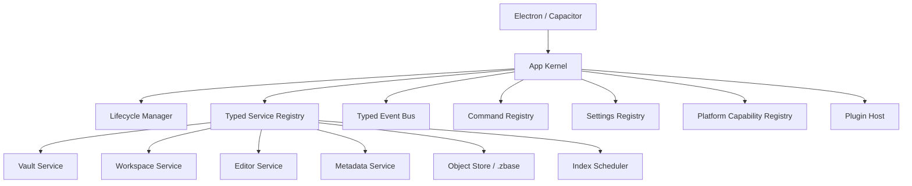
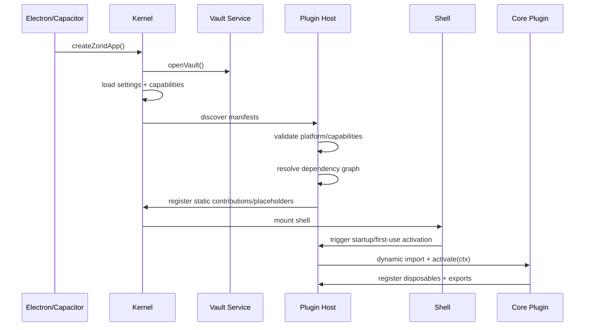

# Kernel and Plugin Host Architecture

Status: v0 design baseline  
Date: 2026-05-27

## 1. Design Goal

Zorid should combine:

- Obsidian-like plugin ergonomics: simple TypeScript plugin entry point, clear app concepts, lifecycle cleanup.
- Neovim-like API discipline: stable extension points, API compatibility metadata, events/commands as core primitives.
- lazy.nvim-like loading: declarative triggers that install cheap placeholders and activate plugins only when needed.

The kernel is the non-disableable app operating system. The plugin host is the controlled extension runtime. Core plugins dogfood this model in v0; arbitrary third-party plugins are designed for but not enabled in v0.

---

## 2. Kernel Responsibilities

The kernel owns orchestration, not product features.

Kernel owns:

- app lifecycle: create app, open vault, load settings, start index/index scheduler, initialize plugin host, mount shell;
- typed service registry;
- typed event bus;
- command registry;
- settings registry;
- workspace/view registry foundation;
- platform capability registry;
- plugin host supervision;
- API compatibility metadata.

Kernel does not own:

- file explorer behavior;
- search UI;
- backlinks UI;
- data-view rendering;
- field semantics beyond stable platform APIs;
- desktop/mobile layout details;
- arbitrary third-party UI internals.



---

## 3. Plugin Host Responsibilities

The plugin host owns extension lifecycle and boundaries.

Plugin host owns:

- manifest discovery and parsing;
- platform/capability compatibility checks;
- dependency graph resolution;
- lazy activation trigger indexes;
- dynamic import / runtime adapter;
- permission-shaped API context creation;
- plugin API exports;
- disposable cleanup tracking;
- error isolation and plugin disablement.

v0 runtime:

- trusted in-process modules for bundled core plugins;
- all access still goes through `ZoridPluginContext` so later worker/process isolation remains possible.

Future runtime:

- worker/process/iframe host adapters for third-party or heavy plugins;
- same public API shape, transported over RPC where needed.

---

## 4. Plugin Entry Point

Zorid plugins should be easy to understand and TypeScript-first.

```ts
import { defineZoridPlugin } from "@zorid/plugin-api";

export default defineZoridPlugin({
  async activate(ctx) {
    ctx.register.command({
      id: "example.say-hello",
      title: "Say Hello",
      run: () => console.log("hello"),
    });
  },
});
```

The plugin author should not need to know how the kernel is built. They receive a scoped `ctx` with stable domain APIs.

---

## 5. Plugin Context Shape

```ts
export interface ZoridPluginContext {
  app: AppAPI;
  vault: VaultAPI;
  workspace: WorkspaceAPI;
  editor: EditorAPI;
  metadata: MetadataAPI;
  objects: ObjectStoreAPI;
  search: SearchAPI;
  fields: FieldsAPI;
  dataViews: DataViewsAPI;
  commands: CommandsAPI;
  settings: SettingsAPI;
  events: EventBusAPI;
  storage: PluginStorageAPI;
  plugins: PluginRegistryAPI;
  register: PluginRegistrationAPI;
  platform: PlatformAPI;
}
```

`register` is the lifecycle-owned registration surface. `platform` exposes desktop/mobile/capability information without exposing raw Electron, Node, or Capacitor internals by default.

---

## 6. Lifecycle-Owned Cleanup

Decision: every plugin contribution must be disposable and owned by the plugin host.

This copies Obsidian's strong cleanup lesson: registering something through the plugin API should make unload cleanup automatic.

```ts
export interface Disposable {
  dispose(): void | Promise<void>;
}

export interface PluginRegistrationAPI {
  disposable(disposable: Disposable | (() => void | Promise<void>)): Disposable;
  event(disposable: Disposable): Disposable;
  command(command: CommandContribution): Disposable;
  setting(schema: SettingsContribution): Disposable;
  view(view: ViewContribution): Disposable;
  viewRenderer(renderer: ViewRendererContribution): Disposable;
  statusItem(item: StatusItemContribution): Disposable;
  editorExtension(extension: EditorExtensionContribution): Disposable;
  markdownProcessor(processor: MarkdownProcessorContribution): Disposable;
  domEvent<K extends keyof HTMLElementEventMap>(
    target: HTMLElement,
    type: K,
    listener: (event: HTMLElementEventMap[K]) => void,
  ): Disposable;
  interval(id: number): Disposable;
}
```

Plugin unload sequence:

```text
plugin deactivate requested
  -> stop new activations for plugin
  -> call plugin.deactivate if present
  -> dispose registered resources in reverse order
  -> unregister exported plugin APIs
  -> mark inactive or failed
```

Cleanup applies to:

- commands;
- settings schemas;
- workspace views;
- `.zbase` renderers;
- Markdown processors;
- editor extensions;
- event listeners;
- DOM listeners;
- intervals/timers;
- metadata subscriptions;
- status bar items;
- plugin API exports.

---

## 7. Platform Split

Decision: platform compatibility is explicit in plugin manifests and enforced by the plugin host.

Desktop and mobile differ in filesystem access, background indexing, input model, available native capabilities, and performance budget. Plugins should declare where they run and which capabilities they need.

```json
{
  "id": "zorid.core.data-views",
  "name": "Data Views",
  "version": "0.1.0",
  "zoridApi": "^0.1.0",
  "kind": "core",
  "platforms": ["desktop"],
  "capabilities": {
    "required": ["vault.read", "workspace.views", "metadata.read"],
    "optional": ["platform.haptics"]
  }
}
```

Platform policy:

- default target should be cross-platform when possible;
- desktop-only features must say so explicitly;
- mobile support may require reduced background work, touch layout, haptic hooks, and app-private vault storage;
- plugin code should use Zorid platform APIs rather than raw Node/Electron/Capacitor APIs;
- incompatible plugins are hidden, disabled, or shown with a clear reason.

Examples:

```json
{
  "platforms": ["desktop"],
  "capabilities": {
    "required": ["desktop.folderVault", "nativeFs.watch"]
  }
}
```

```json
{
  "platforms": ["mobile"],
  "capabilities": {
    "required": ["mobile.appPrivateVault"],
    "optional": ["platform.haptics"]
  }
}
```

---

## 8. Dependency Model

Decision: dependencies are first-class, but only for declared public APIs and activation order. They are not permission to import another plugin's internals.

Why first-class dependencies exist:

- deterministic load order: `data-views` can require `fields` before activation;
- lazy loading: activating one plugin can activate its dependency graph once, in order;
- compatibility checks: the app can reject `charts` if it requires an incompatible `data-views` API;
- user diagnostics: plugin manager can say exactly what is missing or incompatible;
- public API boundaries: a dependency means “I need this exported API,” not “I can reach into your files.”

Manifest shape:

```json
{
  "dependsOn": {
    "zorid.core.fields": "^0.1.0"
  },
  "optionalDependsOn": {
    "zorid.core.data-views": "^0.1.0"
  }
}
```

API lookup for future plugin-defined exports:

```ts
const charts = await ctx.plugins.getApi<ChartsAPI>("vendor.charts");
```

`FieldsAPI` and `DataViewsAPI` are not looked up this way in v0; they are host-owned public-prealpha proxies exposed directly as `ctx.fields` and `ctx.dataViews`.

Rules:

- dependencies are versioned;
- cycles are invalid;
- missing required dependencies disable the dependent plugin;
- missing optional dependencies should degrade gracefully;
- public plugin APIs must be explicitly exported;
- direct package imports between plugins are forbidden.

v0 only needs minimal dependency support for core plugin order. Full third-party dependency resolution can arrive later.

---

## 9. UI Plugin Model

Decision: public plugin UI is framework-agnostic. Vue is Zorid's shell/core implementation detail, not a plugin ABI requirement.

Plugin UI contributions receive containers and lifecycle hooks:

```ts
ctx.register.viewRenderer({
  type: "charts.bar",
  async mount(container, props, ctx) {
    // Plugin may use vanilla DOM, Canvas, WebGL, Vue, Svelte, Solid, etc.
    return () => {
      // cleanup renderer resources
    };
  },
});
```

This is more flexible than requiring Vue because plugins can render with:

- vanilla DOM;
- Vue;
- Svelte;
- Solid;
- Canvas/WebGL;
- a future worker-backed renderer protocol.

Tradeoff:

- plugins get less direct access to shell internals;
- deep native-feeling UI needs good public UI primitives, CSS tokens, menus, modals, settings controls, icons, and view containers.

Mitigation:

- expose a small UI helper/design-system API that is framework-neutral;
- expose CSS variables and design tokens;
- v0 exposes only shell-owned primitives needed by current core plugins: status item, command, settings section, and view container; modal/menu/notice/sidebar replacement APIs belong to the future Plugin Power track;
- allow core plugins to use Vue internally while keeping the public mount contract generic.

---

## 10. Lazy Activation Model

Plugin manifests declare static contributions and activation triggers. The host installs cheap placeholders first, then activates runtime code on demand.

```json
{
  "activation": [
    "onStartup",
    "onCommand:data-views.open",
    "onFileExtension:.zbase",
    "onMarkdownEmbed:.zbase",
    "onView:zbase"
  ],
  "contributes": {
    "commands": [
      { "id": "data-views.open", "title": "Open Base" }
    ],
    "viewRenderers": [
      { "type": "table" },
      { "type": "kanban" }
    ]
  }
}
```

Activation flow:

```text
user invokes placeholder command/view/embed
  -> host resolves trigger
  -> host checks platform/capabilities
  -> host records plugin:load-started with reason/trigger
  -> host loads dependency graph
  -> host dynamic-imports plugin runtime
  -> plugin activate(ctx)
  -> host replaces placeholder with real handler
  -> host records plugin:loaded or plugin:failed
  -> host replays original user action when applicable
```

### 10.1 Lazy-load observability

The plugin host keeps a `PluginLoadRecord` for every discovered plugin. Records include status, activation reason, trigger, dependency chain, duration, missing capabilities, and last error. Plugin manager/devtools must be able to display these records without activating inactive plugins.

Required status states: `discovered`, `placeholder`, `loading`, `active`, `failed`, and `disabled`.

Required host events: `plugin:placeholder-registered`, `plugin:load-started`, `plugin:loaded`, `plugin:failed`, `plugin:disabled`, and `plugin:unloaded`.

---

## 11. API Versioning

Zorid should expose Neovim-inspired API metadata.

```ts
const info = ctx.app.apiInfo();
```

```json
{
  "appVersion": "0.1.0-prealpha",
  "apiLevel": 1,
  "apiCompatible": 1,
  "apiPrerelease": true,
  "namespaces": {
    "vault": { "version": "0.1.0", "stability": "public" },
    "workspace": { "version": "0.1.0", "stability": "public" },
    "fields": { "version": "0.1.0", "stability": "public-experimental", "experimental": true },
    "dataViews": { "version": "0.1.0", "stability": "public-experimental", "experimental": true }
  },
  "functions": [],
  "capabilities": []
}
```

Compatibility policy:

- new optional fields and APIs can be added;
- stable signatures should not be broken inside a compatibility level;
- deprecations should be visible in metadata;
- v0 Platform APIs may be explicitly marked experimental.

### 11.1 API metadata shape

`apiInfo()` must expose API level, backward-compatible level, prerelease status, namespace versions, function metadata, and capability metadata. Public methods must include `since`; deprecations must include `deprecatedSince`; core-only APIs must be marked `core-experimental`; public-prealpha APIs such as `FieldsAPI` and `DataViewsAPI` must be marked `public-experimental`.

### 11.2 Capability-enforced context

`ZoridPluginContext` is created by the plugin host from the manifest plus platform capability registry. In v0, trusted core plugins may start in diagnostic mode, but all method wrappers must be compatible with strict enforcement later. Missing required capabilities disable activation; missing optional capabilities must produce structured diagnostics if used.

---

## 12. Boot Sequence



---

## 13. Locked v0 plugin access model

Zorid uses an ergonomic broad typed plugin facade, not a public generic service locator. Public plugin DX should feel like an app facade (`ctx.vault`, `ctx.workspace`, `ctx.editor`, `ctx.metadata`, `ctx.fields`, `ctx.dataViews`, `ctx.commands`, `ctx.settings`, `ctx.events`, `ctx.platform`) while still preserving package boundaries and capability enforcement.

Public `AppAPI` remains metadata-only and does not expose `getService()`. If bundled core implementation pressure requires privileged access, it must go through an internal-only `CorePluginContext` and be documented as technical debt or converted into a narrow public Platform API.

Neovim-level shell UI replacement is deferred to the future Plugin Power track. v0 supports splits/views/status/commands/editor extensions/Markdown processors/data-view renderers; future work may add command palette renderer overrides, popup/menu renderers, notice/message renderers, modal/menu/notice/theme APIs, shell regions, and richer theme APIs. These remain out of v0 scope to prevent Plugin Power track creep.
