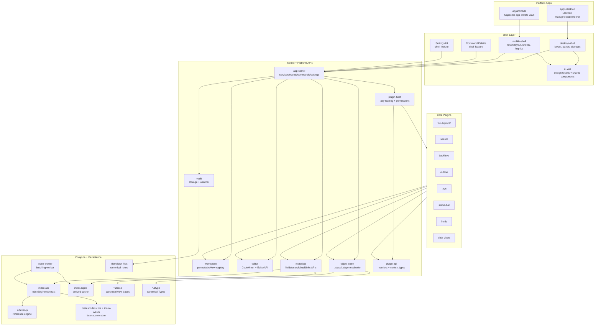
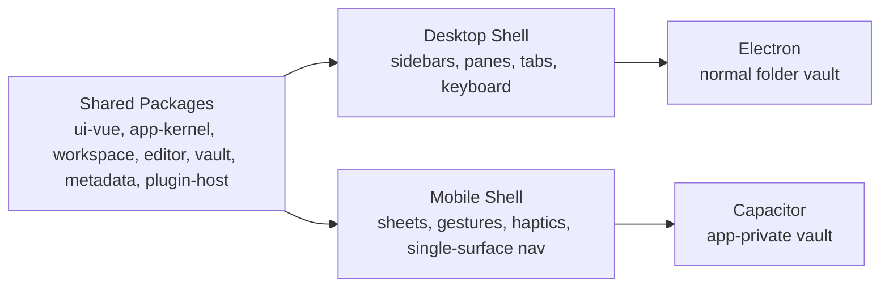
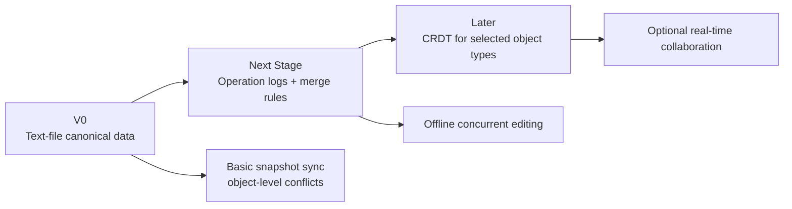
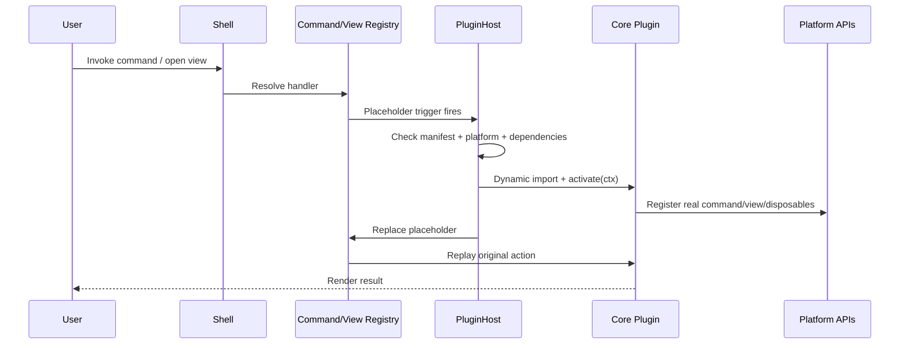
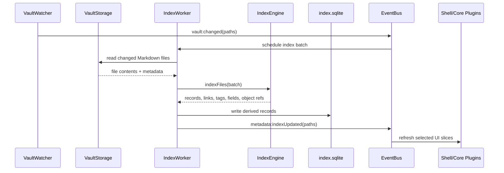

# Zorid Overall Structure Plan

Status: foundational architecture decided  
Date: 2026-05-26

## 1. Product Direction

Zorid is a local-first, cross-platform Markdown workspace with first-class structured data. It should feel as extensible as Obsidian/Neovim while making fields, views, and rich embedded blocks core differentiators instead of add-ons.

Primary goals:

- Markdown files remain the main human-readable note format.
- Structured views can be embedded through `.zbase` files without making Markdown messy; later rich object types can use the same storage principles when needed.
- The app is highly modular and lazy-loaded.
- Core features are bundled as official core plugins where appropriate.
- Third-party plugins are designed for from the beginning, but only core plugins are enabled in v0.
- Desktop uses normal folder vaults.
- Mobile uses app-private vaults.
- v0 is single-user/offline-first; offline concurrent editing is a next-stage goal.

---

## 2. Settled Decisions

| Area | Decision |
|---|---|
| Repository model | Monorepo |
| Frontend framework | Vue 3 + TypeScript |
| Frontend build tool | Vite |
| Package manager | pnpm |
| Desktop runtime | Electron |
| v0 implementation order | Desktop-first; mobile shell/storage skeleton after desktop core works |
| Mobile runtime | Capacitor |
| Ionic | Not core; optional isolated components later |
| Desktop/mobile structure | Thin platform apps + shared packages |
| Desktop layout reference | `../assets/desktop-layout-reference-obsidian.png` for Obsidian-style v0 shell structure |
| Package granularity | Medium-grained domain packages |
| Editor | CodeMirror 6 |
| Index architecture | `IndexEngine` interface first; JS implementation first; Rust/WASM shell present |
| Storage model | Markdown + `.zbase` view files + `.ztype` Type files as canonical data; SQLite for derived index/cache |
| Type model | Fields live in Markdown frontmatter; optional `.ztype` Types define typed/visible/validated field groups via `zorid.type` |
| Mobile vault model | App-private vaults only |
| Desktop vault model | Normal folder vaults |
| Command palette | Shell feature, not plugin |
| Settings UI | Shell feature, not plugin |
| Core bundled features | `plugins/core/*` |
| Third-party plugins | Design for them, but do not enable/support arbitrary third-party plugins in v0 |
| API versioning | Neovim-inspired API level/compatibility metadata |
| Plugin cleanup | Lifecycle-owned disposables for commands, views, events, DOM listeners, timers, and plugin exports |
| Plugin platform support | Manifest-declared desktop/mobile support and required/optional capabilities |
| Offline concurrent editing | Next stage after v0; design object schemas to support it later |

---

## 2.1 Implementation Handoff Specs

Use these files as the v0 implementation source of truth:

- `Plan/Frontend.md` — Vue/Vite/Electron frontend handoff.
- `Plan/Architecture/Kernel and Plugin Host.md` — kernel/plugin-host architecture.
- `Plan/Architecture/Fields and Types.md` — frontmatter fields and `.ztype` Types.
- `Plan/Architecture/Index Schema.md` — SQLite tables and indexing algorithm.
- `Plan/Architecture/Zbase Schema and Filter Grammar.md` — `.zbase` schema and safe filter language.
- `Plan/Architecture/Plugin Manifest.md` — core plugin manifest shape and lazy activation metadata.

## 3. Neovim-Inspired Layering

Zorid should copy Neovim's architectural lesson, not literally make everything a plugin.

Neovim has:

```text
Core editor engine
  commands/keymaps/autocmds/API/runtimepath

Bundled standard plugins/runtime features
  useful official features built on extension points

External plugins
  user-installed ecosystem
```

Zorid equivalent:

```text
Kernel
  lifecycle/service registry/event bus/commands/settings/plugin host

Platform APIs
  vault/workspace/editor/metadata/search/storage/object APIs

Shell
  layout/command palette/settings/plugin manager

Core plugins
  official bundled features built on Platform APIs

Third-party plugins later
  external ecosystem using stable public Plugin API
```

Principle:

> Build a small programmable core with stable extension points, then layer official and community features on top.

---

## 4. Repository Structure

```text
zorid/
  apps/
    desktop/
      src/
        main/              # Electron main process: windows, file system, SQLite, watcher
        preload/           # Secure context bridge
        renderer/          # Desktop Vue renderer entry
      vite.config.ts
      package.json

    mobile/
      src/                 # Capacitor + Vue mobile entry
      capacitor.config.ts
      vite.config.ts
      package.json

  packages/
    app-kernel/            # Service registry, event bus, lifecycle, command/settings registries
    vault/                 # VaultStorage, VaultWatcher, paths, vault profiles
    workspace/             # Panes, tabs, layout tree, view registry
    editor/                # CodeMirror integration and EditorAPI
    metadata/              # MetadataAPI, SearchAPI, fields/filter helpers
    object-store/          # Canonical structured file helpers, starting with .zbase
    db/                    # SQLite cache/index adapters and migrations
    index-api/             # IndexEngine contract and index types
    indexer-js/            # JS reference index implementation
    index-worker/          # Worker batching and engine bridge
    plugin-api/            # Manifest, PluginContext, public API types
    plugin-host/           # Plugin registry, lazy triggers, loader, permission checks
    sync/                  # SyncProvider interfaces and later sync engine
    ui-vue/                # Shared Vue design system and components
    desktop-shell/         # Desktop layout shell, panes, sidebars, desktop interactions
    mobile-shell/          # Mobile shell, sheets, gestures, haptics integration
    shared/                # Shared utilities, schemas, errors

  plugins/
    core/
      file-explorer/
      search/
      backlinks/
      outline/
      tags/
      status-bar/
      fields/
      data-views/

  crates/
    index-core/            # Rust parser/index core later
    index-wasm/            # WASM bindings later

  docs/
    architecture/
    adr/
    prd/

  tests/
    fixtures/
    e2e/
    performance/
```

### Import direction rule

```text
apps -> shell packages -> platform packages -> shared
plugins/core -> plugin-api/platform APIs
platform packages must not import Vue shell packages
third-party plugin API must not expose Vue internals
```

---

## 5. Application Layer Diagram



---

## 6. Desktop vs Mobile Structure

Desktop and mobile should share components and services, but not force identical layouts.

Shared:

- Vue design system components.
- Editor wrapper.
- Plugin view containers.
- Platform APIs.
- Object store APIs.
- Metadata/index APIs.
- Core plugin logic where possible.

Customized:

- Desktop: multi-pane layout, sidebars, tabs, keyboard-first workflows, right-click/hover affordances.
- Mobile: app-private vault, one-main-surface navigation, sheets, gestures, haptics, touch editor toolbar, pause/resume scanning.



---

## 7. Storage Model

Canonical user data:

```text
Markdown files
*.zbase view files
.zorid/types/*.ztype Type files
.zorid/config.json
.zorid/workspace.json
```

Derived/disposable data:

```text
.zorid/index/index.sqlite
.zorid/cache/**
```

Future or separate durable data:

```text
.zorid/history/**
.zorid/sync/**
.zorid/plugins/<plugin-id>/**
```

### Why not canonical SQLite for views?

A live SQLite file is awkward to sync through S3/Drive-style object storage because conflicts happen at the whole-file level. Zorid view definitions should be readable, sync-friendly, and conflict-detected as text files instead.

### View embedding

Markdown uses normal embed syntax with the vault-relative `.zbase` path:

```md
Project dashboard

![[.zorid/views/project-tracker.zbase]]
```

`.zorid/views/` is only the default creation location. Users may store `.zbase` files anywhere in the vault and embed them with their full vault-relative path:

```md
![[Dashboards/project-tracker.zbase]]
```

A `.zbase` file is YAML and may contain multiple views. The order of `views:` is the UI order; there is no `defaultView` field in v0. Opening or embedding a base shows the first view initially and lets the user switch views.

```yaml
schemaVersion: 1
id: project-tracker
name: Project Tracker

views:
  - type: table
    name: Table
    filters:
      and:
        - file.hasLink("01 - Personal/Better ways to say it")
        - '!test.contains("abse")'
    groupBy:
      property: test
      direction: ASC

  - type: kanban
    name: Kanban
    filters:
      and:
        - file.hasTag("project")
        - status.exists()
    groupBy:
      property: status
      direction: ASC

  - type: charts.bar
    name: Status Chart
    filters:
      and:
        - file.hasTag("project")
    x: status
    y:
      aggregate: count
```

Core view types use readable names such as `table`, `list`, `kanban`, `calendar`, and `timeline`. Plugin renderers may register namespaced types such as `charts.bar` or `vendor.plugin.renderer`.

Filters are readable expression strings in v0, not structured query AST YAML. There is no `query`, `source`, `sources`, `dataSources`, or `kind` wrapper in v0 because the primary indexed record is simply a file. Templates are deferred to v1.

### Fields and Types

Detailed design lives in `Plan/Architecture/Fields and Types.md`.

Fields are YAML frontmatter values stored directly in Markdown files. A file may optionally opt into a Type with:

```yaml
zorid:
  type: task
```

Types are stored as `.ztype` files, defaulting to `.zorid/types/*.ztype`. A Type defines field semantics such as `select`, `multiselect`, `date`, `datetime`, `string`, `int`, `float`, and `boolean`.

Typed fields are grouped in the UI inside a box titled with the Type name. Removing `zorid.type` hides the Type-specific box but does not delete the underlying field values; re-adding the Type restores the box with preserved values.

Templates are not required for v0 structured data because Types define field shape, field editors, options, defaults, and `zorid.type` filtering. Templates may return later as body/content scaffolding.

### Storage diagram

```mermaid
flowchart TB
  VaultRoot[Vault Root]
  Markdown[Markdown Notes\n*.md]
  Zorid[.zorid/]

  VaultRoot --> Markdown
  VaultRoot --> Zorid

  Zorid --> ZViews[views/*.zbase\ndefault view-base location]
  Zorid --> Types[types/*.ztype\nType definitions]
  Zorid --> Index[index/index.sqlite\nderived/rebuildable]
  Zorid --> Config[config.json\nsettings]
  Zorid --> Workspace[workspace.json\nworkspace state]
  Zorid --> Cache[cache/**\ndisposable]
  Zorid --> History[history/**\nbackup/timeline later]
  Zorid --> Sync[sync/**\nfuture operation logs]

  Markdown --> Embeds[View Embeds\n![[path/to/base.zbase]]]
  Embeds --> ZViews
  Markdown --> Index
  ZViews --> Index
  Types --> Index
```

---

## 8. Future Offline Concurrent Editing

v0 uses text `.zbase` files for view definitions. The base schema should keep stable lowercase IDs derived from file/view names, with conflict suffixes when needed, so offline concurrent editing can be added later.

Next-stage plan:

```text
.zorid/sync/ops/devices/<device-id>/*.jsonl
```

Operation logs will support:

- offline edits on multiple devices;
- per-object merge rules;
- conflict detection;
- object history and recovery;
- optional CRDT-backed object types later.

CRDT is not a v0 requirement. It may be used later for object types that naturally need collaborative merging, such as canvas/whiteboard-like features.



---

## 9. Kernel and Plugin Host Architecture

Detailed design lives in `Plan/Architecture/Kernel and Plugin Host.md`.

### Kernel vs plugin host

```text
Kernel
  non-disableable app operating system: lifecycle, services, events, commands, settings, capabilities

Plugin Host
  extension runtime: manifests, platform checks, dependency graph, lazy triggers, permissions, cleanup, error isolation

Platform APIs
  typed public surfaces: vault, workspace, editor, metadata, objects/.zbase, search, storage

Shell
  app control UI: command palette, settings, main layout, plugin manager

Core plugins
  official bundled features under plugins/core
```

### Core plugin policy

Core plugins should use Platform APIs rather than random private package internals.

v0 policy:

- Platform APIs are allowed to evolve quickly.
- Core plugins dogfood those APIs.
- Avoid generic `ctx.internal` as a normal pattern.
- If a core plugin needs private access, document the missing API and either add a narrow Platform API or create a temporary explicit bridge.
- Third-party plugins are not supported in v0, but the architecture should not block them.

### Lifecycle-owned cleanup

Every plugin contribution must be registered through lifecycle-owned APIs and return a disposable. The plugin host disposes registered resources in reverse order when a plugin unloads or fails.

```ts
ctx.register.command(command);
ctx.register.event(ctx.events.on("vault:file-created", handler));
ctx.register.viewRenderer(renderer);
ctx.register.domEvent(element, "click", handler);
ctx.register.interval(intervalId);
```

Cleanup applies to commands, settings schemas, views, `.zbase` renderers, Markdown processors, editor extensions, event listeners, DOM listeners, timers, metadata subscriptions, status items, and exported plugin APIs.

### Platform split

Plugin manifests declare where they run and which capabilities they need. This keeps mobile constraints explicit and prevents desktop-only assumptions from leaking into shared plugin code.

```json
{
  "platforms": ["desktop", "mobile"],
  "capabilities": {
    "required": ["vault.read", "workspace.views", "metadata.read"],
    "optional": ["haptics", "nativeShare"]
  }
}
```

Policy:

- default to cross-platform where possible;
- declare desktop-only or mobile-only support explicitly;
- access native features through Zorid platform APIs, not raw Electron/Node/Capacitor by default;
- incompatible plugins are hidden, disabled, or shown with a clear reason.

### Plugin dependency model

Neovim core does not provide a rich manifest-level dependency model, and Obsidian's public plugin API does not make plugin-to-plugin dependencies a central primitive. Zorid should still make dependencies first-class because core plugins such as Fields and Data Views are intended to become extension platforms.

Dependencies are for:

- deterministic load order;
- lazy activation of a dependency graph;
- compatibility checks;
- useful plugin-manager diagnostics;
- declared public API lookup.

They are not permission to import another plugin's internals.

```json
{
  "dependsOn": {
    "zorid.core.fields": "^0.1.0"
  },
  "optionalDependsOn": {
    "zorid.core.data-views": "^0.1.0"
  }
}
```

```ts
const fields = await ctx.plugins.getApi("zorid.core.fields");
```

v0 should implement only the minimal dependency ordering needed by bundled core plugins. Full third-party dependency resolution can come later.

### Framework-agnostic plugin UI

Public plugin UI APIs should not require Vue. Vue is the shell/core implementation framework, not the plugin ABI.

```ts
ctx.register.viewRenderer({
  type: "charts.bar",
  mount(container, props, ctx) {
    // plugin may use vanilla DOM, Canvas, WebGL, Vue, Svelte, Solid, etc.
    return () => {};
  },
});
```

This is more flexible than requiring Vue, but it means shell internals stay private. To keep plugins powerful, Zorid should expose framework-neutral UI primitives: CSS variables/design tokens, menus, modals, notices, status items, sidebar items, settings controls, view containers, and command integration.

### Plugin lazy loading



---

## 10. Indexing Flow



---

## 11. v0 Core Plugins

v0 core plugins:

```text
file-explorer
search
backlinks
outline
tags
status-bar
fields
data-views
```

Shell features, not plugins:

```text
command palette
settings UI
main desktop layout
main mobile layout
plugin manager UI
```

Each core plugin gets its own plan file under `Plan/Core Plugins/`.

---

## 12. v0 Milestone Definition

v0 is complete when Zorid can:

- build from a pnpm monorepo;
- implement desktop-first Electron app flow;
- open a normal folder vault on desktop;
- keep a mobile app/package skeleton compatible with app-private vaults, but implement full mobile UX after desktop core works;
- create/open/edit/save Markdown notes;
- use CodeMirror as the editor;
- navigate files with the file explorer;
- open multiple tabs/panes on desktop;
- run command palette actions;
- edit settings in shell settings UI;
- index Markdown metadata into SQLite;
- extract fields from Markdown frontmatter;
- define `.ztype` Types and assign files with `zorid.type`;
- render Type-declared fields in a grouped UI box;
- embed a `.zbase` file in Markdown with `![[path/to/base.zbase]]`;
- store view definitions in `.zbase` YAML files, defaulting to `.zorid/views/*.zbase`;
- render table and list data-view types;
- search indexed content;
- show backlinks, tags, outline, and status information;
- lazy-load core plugin surfaces where practical;
- rebuild derived index from Markdown + `.zbase` + `.ztype` files.


