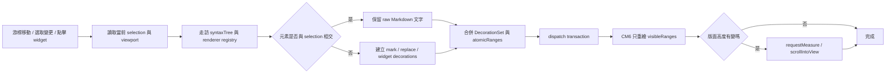
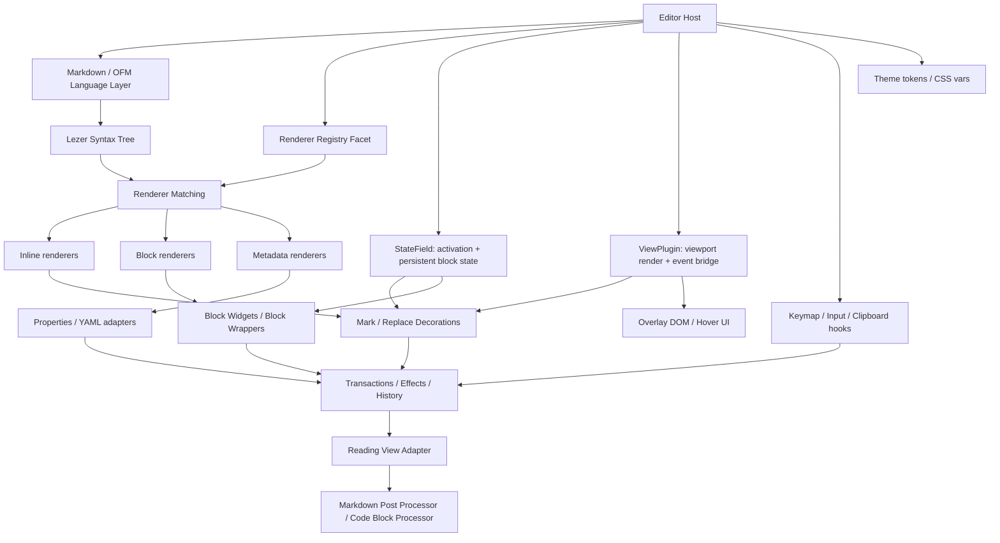
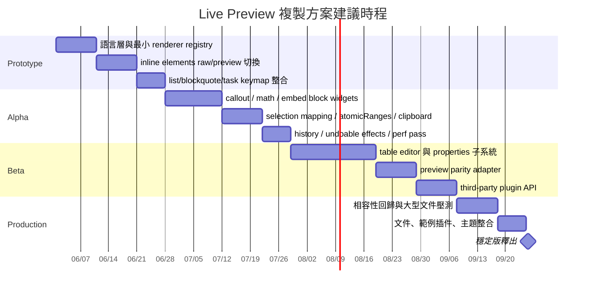

# Obsidian Markdown 即時編輯器研究報告

## 執行摘要

Obsidian 的 Live Preview 不是傳統「所見即所得」編輯器，而是一種**以 Markdown 原始文字為真實資料模型、以游標位置決定是否折疊語法的半預覽式編輯**。官方 help 明確描述：Live Preview 會在編輯時內嵌顯示格式化文字、隱藏大部分 Markdown 語法，而當游標進入格式化內容時，底層語法會重新顯示以便編輯。社群開發者論壇對此也有一致描述，並指出這一層「live edit」規則目前並沒有作為一套可註冊的公開 API 暴露給第三方外掛。換句話說，Obsidian 的核心 UX 不是「把 Markdown 轉成富文字再編輯」，而是「在同一份 Markdown 文字上做 selection-aware 的顯示切換」。 citeturn17search0turn36view0

若把元素逐一拆開來看，可以發現大多數 inline / block 元素都遵守同一個狀態機：**游標未相交時偏向預覽顯示、游標進入時回到可編輯原文、游標離開後再折回預覽**。但這條規則有幾個重要例外：表格在 1.5.3 之後引入新表格編輯器，從「游標進入表格時整塊還原成純 Markdown」轉向「以儲存格為中心的結構化編輯」，因此若想編輯原始表格字元，往往要切回 Source mode；Properties 則是一套蓋在 YAML frontmatter 之上的 typed UI，可在 visible / hidden / raw 間切換；inline footnotes 依官方文件仍只在 reading view 有效，不在 Live Preview 生效。 citeturn36view1turn36view2turn19search0turn38search0

從公開可驗證的技術底座來看，最合理的重建模型是：**Obsidian Flavored Markdown 作為語法層、CodeMirror 6 作為 view / state 引擎、Lezer 作為增量解析樹、Decorations / Widgets / Replace decorations 作為預覽折疊機制、viewport-limited rendering 作為效能基礎**。Obsidian 官方開發文件並沒有公開 Live Preview 內部所有私有規則，但它反覆強調 editor extensions 應透過 state fields、view plugins、decorations 與 viewport 來改變編輯外觀；CodeMirror 官方也明確指出，內容 DOM 不應被外部程式任意直接修改，而應透過 decorations 影響顯示。 citeturn6view2turn6view3turn11search1turn29search0

若要在 CodeMirror 6 中重現接近 Obsidian 的體驗，最穩定的策略不是硬寫一組巨大的 DOM patch，而是建立一個**selection-aware renderer registry**：用 Lezer / Markdown syntax tree 找出可折疊的語法片段；以 `StateField` 管理會改變垂直版面的 block widgets；以 `ViewPlugin` 專注做 viewport 內的 inline / lightweight decorations；以 `WidgetType.eq()` / `updateDOM()` / `estimatedHeight` 控制重繪成本；以 `atomicRanges`、`posAtDOM()`、`domAtPos()`、`clipboardInputFilter` / `clipboardOutputFilter`、歷史 transaction / effects 來維持游標、複製貼上與 undo/redo 的一致性。若還要允許第三方擴充，就必須再往上抽出 renderer registration、priority、theme tokens、preview adapters 與 command/keymap hooks。 citeturn12view0turn15view0turn15view1turn30view0turn31view0turn24view0

## 範圍與研究基準

本報告以 **2026-05-29 可公開查證的官方 help、changelog、Obsidian 開發文件、CodeMirror 6 官方文件與少量社群案例** 為研究基準。使用者要求的「最新版 Obsidian」在官方 help 文件中**沒有綁定單一精確版號**，因此本文對「一般 Live Preview 行為」採用目前 help 文件為準；對於**明顯曾在不同版本間變動**的行為，例如表格編輯器、圖片 resize、腳註/表格 bug、callout 互動等，則會額外引用 changelog 並明確標註版本脈絡。 citeturn17search0turn27search10turn26search9turn25search0

Markdown 方言方面，Obsidian 官方明示它使用 **CommonMark、GitHub Flavored Markdown 與 LaTeX** 的組合，並在其上加入 wiki links、embeds、block refs、comments、callouts、task lists、tables 等 Obsidian 特有或擴充語法；同時官方也明示 **Markdown 不會在 HTML 元素內被渲染**，理由是效能最佳化與避免大型文件下解析器複雜度過高。這一點對重製 Live Preview 非常關鍵，因為它意味著你不能把所有「看起來像富文本的東西」都交給 HTML parser，而必須嚴格區分 Markdown parser 與 HTML 區域的語義邊界。 citeturn20search0

平台方面，官方文件並未逐條為 desktop / mobile / web 分別定義所有 Live Preview 行為，而不少可觀察到的互動，例如右鍵表格選單、callout 右鍵改型別、hover preview、圖片角落拖拉 resize，本質上偏 desktop。凡是明顯依賴滑鼠右鍵、hover 或桌面拖拉的行為，本文都視為**桌面端顯著特徵**；若官方未對其他平台做相同行為保證，則標為「未指明」。 citeturn18search0turn18search2turn40search0turn27search10

證據層級上，本文採取以下原則：**Obsidian 官方 help / changelog 與 CodeMirror / Lezer 官方文件優先；官方開發文件次之；社群論壇與社群插件原始碼/README 只用於補足官方未細寫的 UX 邊界或可行實作模式**。因此，凡是屬於「Obsidian 內部 Live Preview 私有規則引擎」的描述，本文都會明說是**基於公開文件的高可信推論**，而不是把未公開細節當成既成事實。 citeturn36view0turn24view0turn29search1

## Obsidian Live Preview 的行為模型

### 核心 UX 狀態機

官方 help 對 Live Preview 的最核心描述只有一句，但其實已經定義了整個 UX：**格式化內容預設用預覽顯示；游標進入後露出底層 Markdown 語法供編輯；離開後回到較接近 reading view 的視覺表現**。這表示 Live Preview 的本質不是另存一份富文字模型，而是針對同一段 source text 在「raw」與「rendered」之間切換可視化層。從開發上看，這非常接近「replace / widget decoration 在 selection 不相交時生效；selection 一旦相交就撤掉 decoration」的模型。Obsidian 社群開發者也明確指出第三方目前能用 CM6 `mark` / `replace` decorations 模仿一部分視覺效果，但無法直接擴充原生那套「點進去露語法、點出去再隱藏」的私有 live-edit 層。 citeturn17search0turn36view0turn6view2

多數文字級元素都符合這個模式，但表格、Properties、圖片 resize、某些 block widgets 不是單純的「隱藏語法字元」而已，而是有**獨立互動面板或結構化 widget**。因此，若你想複製 Obsidian，實作上不應只做一種 renderer；至少要分成三類：**只改樣式的 mark renderers、會隱藏 source 的 replace/widget renderers、以及具有專屬子互動的 structured widgets**。這也是本文後面提出 registry API 與 renderer capability flags 的原因。 citeturn36view2turn19search0turn27search10

### 行內與文字級元素矩陣

下表把段落、標題、強調、行內程式碼、連結與錨點、腳註參照拆開看。需要先說明一個限制：**官方沒有對每一種 inline 元素逐一文件化「游標進入後會如何露出哪幾個字元」**，因此凡屬此類細節，本文都以「Live Preview 全局規則 + 官方語法文件 + 社群可核對案例」綜合判讀，並在必要時標示為「未逐項明示」。 citeturn17search0turn38search0turn36view0

| 元素 | 靜態呈現 | 游標 / 選取 / 輸入切換 | 滑鼠 / 複製貼上 / 復原與邊界 | 主要來源 |
|---|---|---|---|---|
| 段落 | 單次 `Enter` 在標準 Markdown 下仍屬同一段落；`Shift+Enter` 可直接插入換行；若開啟「精確的換行符號」，換行語義更接近標準 Markdown。 | 段落本身沒有像 `**` 或 `` ` `` 那樣可折疊的語法殼，因此游標進入後通常只是一般文字編輯；真正影響呈現的是行尾空白、雙換行或設定。 | 複製貼上通常是純文字/Markdown；undo/redo 行為沒有段落特例。邊界案例在於使用者往往把「很多空白行」當排版，但 Markdown 只把它視為單一段落分隔。 | citeturn21view0turn38search0 |
| 標題 | `#` 到 `######` 對應六層標題；在 Live Preview 中通常以接近 reading view 的標題樣式顯示。 | 依 Live Preview 全局規則，非 active 狀態下多數格式字元會被隱藏；社群 CSS 片段之所以存在，正是因為許多人想把非 active 行被隱藏的 heading hashes 再顯示出來，反向證明預設 UX 傾向隱藏它們。游標進入標題行時，`#` 標記會回到可編輯狀態；官方也曾修正 heading 行尾 `#` 在 LP 失敗的情況。 | 雙擊並沒有官方為「標題」單獨定義特殊動作，通常沿用 editor/瀏覽器選字。若標題內混用 inline code / math，歷史上曾有尺寸與選取 bug，表示此區是 selection mapping 的敏感地帶。 | citeturn38search0turn17search0turn47search15turn26search4turn27search7 |
| 粗體／斜體／刪除線／反白 | `** **`、`* *`、`~~ ~~`、`== ==` 等在 LP 中預設以套用後的樣式顯示，而不是一直把分隔符號露在畫面上。 | 官方未逐元素列出切換細則，但 LP 全局規則明確表示游標進入格式化內容時會露出底層語法，因此強調符號在編輯時會重新可見。混合格式如粗體內嵌斜體是官方文件明確支援的，因此 renderer 應允許 nested ranges，而不是單層替換。 | 文字格式可透過編輯快捷鍵套用；Obsidian 早期新編輯器就提供 `Ctrl/Cmd+B`、`Ctrl/Cmd+I`，但目前精確預設 hotkey 仍以使用者設定為準。複製時原則上應保留 Markdown source，而不是只複製裸文本樣式。 | citeturn38search0turn17search0turn28search8 |
| 行內程式碼 | 單反引號產生 inline code，若內容內含反引號可改用雙反引號包住。LP 會把它以 code 樣式顯示。 | 與強調類似，游標不在其中時偏向顯示為 code chip/inline code；游標進入時需能露出反引號並保留精確 selection。從歷史修正看，inline code 在 headings 等混合情境曾出現尺寸錯誤，說明它不是單純 CSS span，而是需要精確 inline metrics 管理。 | 複製應保留反引號與內容；若直接編輯 widget DOM 而非 source text，極易破壞精確字元數與 selection。這是實作上應避免的。 | citeturn38search0turn17search0turn27search7turn11search1 |
| 內部連結／外部連結／標題錨點 | 官方明示 wiki links 與 Markdown links 在 editor 中顯示方式相同；可連到檔案、標題、子標題與 block IDs；若啟用 Page Preview，編輯模式下懸停時按 `Ctrl/Cmd` 可開預覽。 | LP 中連結通常顯示為已解析的 link text；進入編輯狀態時需能回到 `[[...]]` 或 `[text](url)`。官方 changelog 顯示 `Ctrl/Cmd+Click` 可開啟 Markdown links，之後又加入 `Ctrl/Cmd+Alt+Click` 在 LP 中編輯連結，表明「開啟」與「編輯 source」是兩套不同手勢。 | 右鍵連結可開啟或建立檔案；Paste URL as link 在 CM6 markdown 套件本身就是內建能力，而 Obsidian 1.12.7 也明確修正了多游標選取後貼入 URL 時自動包成 Markdown link 的行為。 | citeturn40search0turn21view2turn27search1turn27search13turn27search12turn14search1 |
| 腳註參照 | `[^id]` 形式的腳註參照會在 reading / preview 流程中解析；行內腳註 `^[...]` 官方明言**只在 reading view 有效，不在 Live Preview 生效**。 | 腳註參照本身在 LP 中通常仍以 source-like token 存在，但 reading view 的腳註內容排版較完整。1.6.1/1.6.2 又補了多行 footnotes 與 reading view 腳註渲染修正，顯示這是 preview / metadata / editor 三者交界處。 | 若要編輯腳註內容，官方提供 Footnotes view 核心外掛可列出所有腳註並點擊編輯；這比在 LP 中把整個腳註定義做成大型 widget 更接近 Obsidian 現有 UX。 | citeturn38search0turn4search5turn26search4turn28search9 |

### 區塊與結構級元素矩陣

對 block 級元素來說，真正重要的不只是「看起來像不像 preview」，而是**游標與 selection 能不能乾淨地跨過 widget 邊界**。這也是 Obsidian changelog 中經常出現的 bug 類型，例如上下方向鍵進出 code blocks / embeds / tables、點擊 previewed blocks 的 selection、跨隱藏 Markdown syntax 的選取、以及 checkbox 行首定位。 citeturn26search2turn27search13

| 元素 | 靜態呈現 | 游標 / 選取 / 鍵盤切換 | 滑鼠 / 複製貼上 / 復原與邊界 | 主要來源 |
|---|---|---|---|---|
| 程式碼區塊 | 支援 fenced code blocks 與縮排 code blocks；可指定語言做語法高亮。官方也提醒 reading view 使用 PrismJS，而 source mode / LP 的 syntax highlighting 可能不同。 | 從 changelog 可知 LP 曾改善 code block 在「游標不活躍時」的樣式、上下箭頭與 block 互動、切檔時 proper unload，以及 copy icon 顯示，這表示 code block 在 LP 中屬於帶有 block-level 特殊行為的區域，而非純文字 span。 | 官方沒有單獨文件化「點一下 code block 是否整塊還原 source」的規則；能確定的是它在 LP 中是可導航、可卸載、可顯示 copy affordance 的特殊塊。長 code blocks 的重點應是懶載入與 viewport 管理，而不是永遠全量建 DOM。 | citeturn38search0turn27search1turn26search2turn27search8turn27search15turn11search1 |
| 清單 | 無序清單、有序清單、巢狀清單都屬標準支援；有序清單中可用 `Shift+Enter` 插入換行而不改變編號。 | CodeMirror 的 markdown keymap 內建把 `Enter` 綁到 `insertNewlineContinueMarkup`、把 `Backspace` 綁到 `deleteMarkupBackward`，而 Obsidian changelog 也多次提到改善 blockquotes / lists 的 `Enter` handling，因此在重製時不應自己從零處理 list continuation。`Tab` / `Shift+Tab` 則用於縮排/取消縮排 selected list items。 | 巢狀清單是官方文件明確支援的邊界案例，因此 selection mapping 必須能跨不同 list depth。若把整個 list marker 都做成不可進入的 atom，容易讓編輯體感與 Obsidian 不一致。 | citeturn38search0turn14search1turn27search2turn28search8 |
| 核取方塊／任務清單 | `- [ ]`、`- [x]` 形式的 task lists 在 LP 中會被替換成可點擊 checkbox；完成項會被劃線並灰化，以接近 reading view。 | 這是最典型的「語法 token + 結構 widget」混合元素。官方最早就把 checklists 定義為「會被 checkbox 取代，點擊可切換狀態」。但 changelog / forum 也顯示其游標定位高度脆弱：`Home` 鍵曾在 1.0.3 與舊行為不一致；1.5.8 又出現上下鍵、刪除、cut/paste 時游標自動跳到 checkbox 後方的 bug。 | 這些歷史案例說明：checkbox 不能只靠 CSS 假裝，它需要有**穩定的 source position mapping**。複製貼上時若 selection 包到 checkbox token，應保留原始 `- [ ]`/`- [x]` Markdown，而不是只複製畫面上的勾選狀態。 | citeturn38search0turn27search0turn26search2turn37view0turn37view1 |
| 區塊引用 | `>` 產生 blockquote；callout 其實是 blockquote 第一行帶 `[!type]` 的特殊形式。 | 官方 changelog 提到改進 blockquote handling，以及 blockquotes / lists 的 `Enter` handling，表示 blockquote 在 LP 中並非純靜態樣式，而是要與 continuation logic 一起處理。游標通常應能在 active line 看到 `>` source，離開後則偏向顯示為帶視覺縮排/邊線的引用塊。 | 複製貼上 blockquote 時應保留前綴 `>`。若 blockquote 內含多行、巢狀 list 或 math block，需特別注意 continuation、indent 與 mounted widgets 之間的邊界。 | citeturn38search0turn26search2turn27search2 |
| 水平橫線 | `***`、`---`、`___` 的獨立行都可產生 horizontal rule。 | 官方沒有單獨文件化 LP 對 horizontal rule 的切換細節，因此只能依 Live Preview 全局規則推論：游標不相交時偏向顯示分隔線；若要編輯實際分隔符，需讓該行回到 raw source。 | 這類元素是「整行單義 token」，最適合用 replace decoration + block placeholder 來做。需要注意的是，若使用者在該行前後做插入刪除，selection 與 scroll 不應跳躍。 | citeturn38search0turn17search0 |
| 公式 | Obsidian 以 MathJax / LaTeX 支援公式；早期 LP 先支援 block math 預覽，再補上 inline LaTeX rendering。 | 由 changelog 可見，公式屬 LP 的 renderer-driven 元素：block (`$$`) 先有 preview，之後 inline LaTeX 才補上；又曾修正 blockquote 中多行 block math 失效，表示 math renderer 與區塊容器有互動。 | 數學內容的 raw/edit 切換若做得太激進，游標位置常會跳。重製時建議：游標相交時回 raw source；未相交時 render 成 widget；對 block math 補 `estimatedHeight` 以減少 reflow。 | citeturn18search0turn27search4turn27search1turn27search2turn30view1 |

### 表格、媒體、嵌入與中介資料矩陣

這一組元素是最能看出「Obsidian Live Preview 不是單一 renderer，而是多種 renderer 共存」的地方。表格、Properties、images、embeds、callouts 都曾在 changelog 中被當成特殊 widget 類別處理，而且它們的 UX 明顯比單純 inline formatting 更接近「可點擊的小型編輯器」。 citeturn25search0turn19search0turn27search10turn26search10

| 元素 | 靜態呈現 | 游標 / 選取 / 鍵盤切換 | 滑鼠 / 複製貼上 / 復原與邊界 | 主要來源 |
|---|---|---|---|---|
| 表格 | 官方 help 說明 LP 中可右鍵表格新增/刪除/排序/移動列欄與對齊；表格內容也可包含連結、嵌入與一般 Markdown。 | 這是版本差異最大的元素。社群在 0.14.1 時描述的行為是「游標一進表格，整張表格還原成 source markdown」；但 1.5.3 後引入新表格編輯器，很多使用者反映若想編輯原始 Markdown 必須切回 Source mode。 | 官方 changelog 進一步補了 table selection UX：點擊外部會清除 cell selection、triple-click 選單一儲存格文字、quadruple-click 選整張表、1.12.7 起未選取時 copy/cut 只複製 cell 內容。大表格與含長文字/圖片的表格歷來是 UX 痛點。 | citeturn18search0turn36view1turn36view2turn36view3turn25search0turn27search12turn7search17 |
| 圖片 | 外部圖片可用 Markdown image syntax，vault 內圖片可用 embeds；LP 會直接顯示預覽圖，且可指定尺寸。 | 圖片在 LP 中不是單純文字替換，而是具有額外互動的 media widget。最新 changelog 顯示：圖片可在 Live Preview 由角落拖拉調整尺寸，雙擊角落可重設尺寸。當要改路徑/alt/size source 時，仍須回到 Markdown 文本位置。 | 滑鼠互動最明確，鍵盤編輯 source 的契約則官方未逐項文件化。若大量圖片/embeds 造成點擊位置偵測失準，官方曾修正，說明 hit testing 是 widget 邊界上的常見風險。 | citeturn38search0turn39search0turn27search4turn27search7turn27search10turn27search3 |
| 嵌入 | `![[...]]` 可嵌入 note、heading、block、image、audio、PDF、canvas 等，且與來源同步更新。0.13.0 起 LP 就將 embedded notes、images、audio、video、PDF 與 wikilink notes 直接 preview 在 editor 中。 | 嵌入在 LP 中顯然是 block widgets：官方反覆修正上下方向鍵進出 embeds、點擊與選字、切檔後 proper unload、callout 裡 nested embeds 的行為。游標若要進入 source，多半是透過點到 widget 對應 source 邊界或切回 source mode。 | 1.0.0 changelog 明言「點擊以編輯 LP widgets（例如 tables 或 callouts）時會把視圖捲到 widget 開頭」，雖未逐字列 embeds，但 0.14.3 又明言改善 callouts 與 embeds 的 clicking experience，可合理視為同類 widget 邊界問題。 | citeturn39search0turn27search4turn27search13turn27search2turn27search15turn26search10 |
| 註標 Callouts | Callout 寫法是 blockquote 第一行使用 `[!type]`；支援 custom title、可折疊 `+/-`、nested callouts、自訂類型。官方 help 並明說插入 callout 命令後，游標會自動放到標題欄位。 | LP 對 callout 提供比一般 blockquote 更多互動：help 與 changelog 都提到可在 LP 中右鍵 callout 標題快速改型別；多個版本還修掉 callout 中 unresolved links、nested embeds、checklists、copy button 等互動問題。 | 這說明 callout 不只是語法染色，而是**結構化 block widget + contextual menu**。在重製時，最佳做法不是嘗試直接 contenteditable 編 callout widget DOM，而是點進去 reveal source 或開啟結構化 block editor。 | citeturn18search2turn26search6turn26search1turn26search0turn26search9 |
| YAML frontmatter／Properties | Properties 是儲存在檔首 YAML frontmatter 的結構化資料，但在 editor 中可顯示為 typed UI；可在 visible / hidden / raw 間切換。文字、清單、數字、checkbox、日期、tags 等型別皆有專屬輸入方式。 | 這是最明顯的「widget over source」案例。help 明示在檔首輸入 `---` 會出現 UI row；若設定為 raw，則直接顯示 YAML。巢狀屬性不支援，官方建議改用 Source mode；屬性中的 Markdown 刻意不支援。 | 鍵盤契約最完整：`Cmd/Ctrl+;` 新增屬性、Tab/Shift+Tab 在屬性間巡覽、左右箭頭切換 name/value、`Cmd+Z` / `Cmd+Shift+Z` undo/redo。changelog 也多次修正 invalid frontmatter 高亮、編輯 properties 時 frontmatter 暫時露出、額外換行等問題。 | citeturn19search0turn25search1turn28search0 |
| 腳註定義 | 標準 `[^id]: ...` 腳註定義可跨多行；1.6.1 起允許多行 footnotes 中有空白行。 | 腳註定義本身通常仍以 source text 編輯，而不是完整 widget；官方給的主要輔助方式是 Footnotes view。這代表 Obsidian 並沒有把所有 semantic elements 都做成 LP widget，而是會依編輯頻率與複雜度取捨。 | 若複製整段腳註定義，合理預期應複製 Markdown source。若只是想改 footnote 內容，Footnotes view 提供更穩定的入口。 | citeturn38search0turn4search5turn26search4 |

整體看下來，Obsidian Live Preview 的 UX 可概括成一句話：**大部分元素是「游標感知的語法折疊」，少部分元素是「游標感知的結構化小編輯器」**。巢狀清單、粗體內嵌斜體、表格中含連結/嵌入、callout 中含 checklist/embed、長 code blocks、大型 tables，都是這套狀態機最容易出問題的邊界。官方 changelog 長期都在修 selection、arrow key、clicking、widget unload 與 copy/cut/paste，這與 CodeMirror 6 的 block widget / viewport / mapping 模型完全一致。 citeturn38search0turn18search0turn26search2turn27search2turn27search12

## 渲染基礎與游標驅動切換

### 公開可驗證的渲染底座

從語法層開始，CodeMirror 官方的 `@codemirror/lang-markdown` 提供 Markdown language support，支援 strict CommonMark 與 GFM 變體，並允許加入 parser extensions、指定 fenced code block 的語言支援、以及啟用一組 Markdown-specific keymap。這個套件內建的 `markdownKeymap` 就把 `Enter` 綁到 `insertNewlineContinueMarkup`、把 `Backspace` 綁到 `deleteMarkupBackward`；同時也有 `pasteURLAsLink` 這類與 Markdown UX 高度相關的行為。對於要重製 Obsidian 的人來說，這些是非常重要的基底，而不是應該自己再發明一次的功能。 citeturn14search1turn13view1turn13view2

再往下一層是 Lezer 與 syntax tree。Lezer 官方明說它的樹結構是為了**緊湊記憶體表示與增量重用**而設計；CodeMirror 的 `syntaxTree(state)` 取得的是目前可用的 parse tree，而 `ensureSyntaxTree` / `syntaxTreeAvailable` / `forceParsing` 又提供了在需要時把 parse 推進到特定位置的能力。更重要的是，ParseContext 還把 viewport 納入考量，表示 parser 與 renderer 可以協作地把大量文件的工作延後到可見區附近。這正好對應 Obsidian 官方強調的「editor 支援 huge documents，因為只渲染 visible viewport」。 citeturn10search2turn29search0turn6view3

顯示層則幾乎可以直接對應到 CodeMirror 官方文件。Obsidian 開發文件與 CM6 官方都指出：**decorations 是改變顯示的正規機制**，種類包括 mark、widget、replace、line decorations；其中會影響垂直版面結構的 decorations 必須以「直接」方式提供，因為 viewport 是根據版面結構算出來的。官方也明言若想讓裝飾區段在游標移動與刪除時像原子單位一樣被跳過，應把對應 range 同時提供給 `EditorView.atomicRanges`。這與「inactive 時把整段 source 收成 widget、active 時再放出原文」的需要高度吻合。 citeturn6view2turn12view0turn16search6turn31view1

在 DOM 與更新循環層，CodeMirror System Guide 的敘述幾乎就是 Live Preview 複製方案的地圖。官方說明 editor 只渲染 viewport 內內容、更新時把 DOM 寫入與 layout 量測分兩階段做、必要時要用 `requestMeasure()`，而且**不期望外部程式去直接改寫它管理的內容 DOM**；若真的需要影響顯示，應走 decorations。對 block widgets 來說，`WidgetType.eq()`、`updateDOM()`、`estimatedHeight`、`ignoreEvent()`、`coordsAt()` 又形成一套完整的重繪與 hit-testing 契約。 citeturn11search1turn15view3turn30view0turn30view1

Obsidian 本身並沒有公開一份「Live Preview rule engine」。但它的開發文件提供了 `registerEditorExtension()`、state fields、view plugins、decorations、viewport 這些能力；社群參考插件 `obsidian-cm6-attributes` 也直接展示出一條非常接近正解的路徑：**解析 markdown syntaxTree，然後加各種 Decorations 來增強 editor**。加上論壇上要求「把原生 live edit 規則暴露給插件」的提案，可以合理推知：Obsidian 的原生 Live Preview 內部就是某種 selection-aware decorations/widgets 機制，只是那套規則與註冊入口尚未對外公開。 citeturn5search1turn6view2turn24view0turn36view0

### 游標驅動切換的公開可重建模型

若把 Live Preview 抽象成事件流，它最像下面這張圖：selection 移動或 pointer 事件發生後，系統根據 syntax tree 找出與游標相交的元素，針對**未相交元素**建立 preview decorations，針對**已相交元素**保留 raw text，最後把 selection 與 scroll 透過 transaction 一起更新。這樣做的好處是，source text 永遠是 canonical model，preview 只是 view layer。這也最符合 CodeMirror「immutable state + transactions + decorations」的設計哲學。 citeturn16search1turn15view4turn29search1



要把這件事做對，核心難點不是「怎麼把文字換成漂亮 DOM」，而是**怎麼在切換前後保住游標、selection、scroll 與複製貼上的一致性**。這裡 CM6 官方已經提供了所需拼圖：`domAtPos()` / `posAtDOM()` 可在 source position 與 widget DOM 間來回映射；`coordsAtPos()` 與 `scrollIntoView` effect 可在切換後保持視圖穩定；`transaction.changes` 可以把 selection 映射到變更後文件；`focusChangeEffect` 則能在 editor 失焦/得焦時附加額外 effects。若 widget 自身要吃事件，則必須覆寫 `ignoreEvent()`，否則預設是忽略 widget 內事件。 citeturn15view0turn15view1turn15view2turn15view4turn30view0turn30view4

從 UX 角度看，**多數元素不需要動畫，只需要穩定的「不跳」**。如果要做視覺提示，最好的做法不是讓 raw / preview 之間大幅淡入淡出，而是用輕量 CSS cue，例如 active line 背景、active renderer 的淡色輪廓、hover affordance、圖片 resize handle、表格 cell focus ring。表格、圖片、properties 這類結構 widget 更需要的是 focus 樣式與 scroll 穩定性，而不是華麗 transition；因為使用者真正厭惡的通常是 selection 丟失、游標跳位與整塊 widget 重排。這也是官方 changelog 長期集中修 selection、clicking、arrow keys 與 flicker 的原因。 citeturn25search0turn27search10turn28search7

### 渲染方案比較

下表整理重製 Live Preview 時最常見的幾種實作手法。這張表的重點不是哪一種「最強」，而是哪一種**最適合某類元素**。

| 方案 | 能做什麼 | 適合哪些元素 | 對版面結構的影響 | 游標/選取難度 | 與第三方插件共存性 | 建議 |
|---|---|---|---|---|---|---|
| `Decoration.mark` | 套 class / attributes、包一層 DOM 標記、不隱藏 source | 粗體、斜體、連結著色、active line cues、tag tint | 低；通常不改變垂直版面 | 低 | 高；最不容易與他人衝突 | 適合「看起來像 preview，但仍保留文字骨架」的 inline element。 citeturn6view2turn16search6 |
| `Decoration.replace + inline Widget` | 隱藏一段 source，換成 inline DOM | 行內程式碼 chip、link pills、數學 inline renderer、簡單 checkbox token | 中；不應跨 line-break | 中到高 | 中；若重疊 replace 容易互斥 | 最像 Obsidian inline LP 的核心機制。 citeturn12view3turn31view1 |
| `Decoration.replace + block Widget` / `blockWrappers` | 把整塊 source 換成 block DOM，或包住多行 | 表格、callout、embeds、block math、結構化 code block preview | 高；會影響垂直版面，因此通常要直接提供 | 高 | 中；需要明確 capability boundary | 適合真正的 block widgets，但要搭配 `estimatedHeight` 與 `requestMeasure`。 citeturn12view3turn15view3turn31view1 |
| 外部 overlay DOM | 在 editor 外疊浮層或絕對定位 UI，不改 source content DOM | resize handles、hover toolbar、link / image contextual menu、selection tooltips | 低到中；通常不改文檔流 | 中 | 高；因為不直接碰文檔內容 | 適合暫時性操作 affordance，不適合承載主渲染。直接改 editor content DOM 會與 CM6 契約衝突。 citeturn11search1turn16search9 |

還有一個常被低估的選擇，是**StateField 與 ViewPlugin 的分工**。Obsidian 開發文件已經講得很清楚：若 decoration 只需要依 viewport 計算，通常 `ViewPlugin` 效能較佳；若 decoration 會影響 viewport 結構，例如插入 block widgets 或替換跨行內容，就應交給 `StateField` 直接提供 decorations。這個分工對 Live Preview 幾乎是關鍵原則，而不是風格喜好。 citeturn6view2

| 決策點 | `StateField` | `ViewPlugin` | 實務建議 |
|---|---|---|---|
| 適用場景 | 需要持久 state、跨 viewport、改變 block 結構 | 只看 visibleRanges、隨 scroll / selection 重算 | 把 block widgets、fold state、activation state 放 `StateField`；把輕量 viewport renderers 放 `ViewPlugin`。 citeturn6view2turn33search2 |
| 效能特性 | 穩定但較重；可跨整份文件存 decoration set | 較輕；可只掃 visibleRanges | Live Preview 應兩者並用，而不是硬選其一。 citeturn6view2turn11search1 |
| 對第三方擴充 | 容易成為共享 truth source | 容易做 plugin-local 視圖 | 用 Facet/Registry 聚合插件設定，再由核心 field/plugin 消費。 citeturn29search1turn33search0 |

## 以 CodeMirror 6 重現與對外擴充的架構

### 推薦的 CM6 元件組合

若目標是「重現 Obsidian，而不是只做 Markdown 美化」，我建議把架構分成五層：

第一層是 **language layer**。基礎可以直接用 `@codemirror/lang-markdown`，但要承認它**不是 Obsidian Flavored Markdown 的完整等價物**。官方 README 說它預設提供 GFM 加上 subscript / superscript / emoji 等語法，並允許透過 `extensions` 擴充 parser。因此，對 wikilinks、embeds、callouts、block IDs、comments、properties 等 OFM 特性，你需要自己加 parser extension 或外掛語法匹配器。這也是為什麼「Obsidian 等級的 live editor」不能只靠 vanilla `markdown()` 一個 extension。 citeturn14search1turn20search0

第二層是 **semantic renderer registry**。這一層不要直接綁定 DOM，而是先輸出「某個 syntax node 在目前 selection / focus / viewport 條件下，應該用 raw、preview 或 structured-editor 呈現」的判斷。這樣一來，表格與 callout 可以是 block structured widgets，粗體與 inline code 可以只是 replace-inline，標題與特定鏈結則可只用 mark 重染，彼此不會互相污染。這種 registry 模式也最適合第三方插件。 citeturn6view2turn24view0turn36view0

第三層是 **activation state**。要重現「游標進入顯示 source、離開折回 preview」，核心狀態其實只有兩類：當前 selection 是否與 renderer source range 相交，以及目前 block widget 是否被顯式 activate。這個 activation state 適合放在 `StateField`，因為它需要跨 transaction、history、focus 與 scroll 保持一致。對於 block widgets，還應把 active widgets 的 ranges 也輸出給 `EditorView.atomicRanges`，避免一般游標移動與刪除直接闖進 widget 內部。 citeturn12view0turn31view1

第四層是 **input / command layer**。這一層整合 `markdownKeymap`、自訂 keymap、`inputHandler`、transaction filters、clipboard filters。列表與 blockquote continuation 直接沿用 Markdown keymap；links 的 paste-as-link、tables 的 cell copy、widgets 的 point-to-source activation 可用 input/clipboard hooks 或 commands 實現。若 plugin 想插隊，就用 precedence 與 facet ordering 控制，而不是互相 monkey-patch DOM。 citeturn14search1turn31view0turn33search0turn29search0

第五層是 **preview parity layer**。如果你不打算只做編輯模式，還要與 reading view 保持一致，就應該把 renderer 核心抽象成「同一份 element spec，可輸出為 Live Preview decoration，也可輸出為 Reading View post-processor / codeblock renderer」。Obsidian 開發文件已經把 preview pipeline 的關鍵鉤子講清楚：`registerMarkdownPostProcessor()` 與 `registerMarkdownCodeBlockProcessor()` 是 reading mode 的主要擴充入口；而 editor 這邊對應 `registerEditorExtension()`。若能共享 element spec，就能減少 live/reading 兩套 renderer 漂移。 citeturn41search0turn9search3turn5search1

### 元件圖



### 關鍵實作模式與範例

下面這個型別定義是我建議的最小 renderer API。重點在於：**第三方插件不直接操作 editor content DOM，而是回傳 renderer spec，由核心主機負責轉成 decorations/widgets/history/clipboard 行為**。

```ts
import type {Extension, EditorState, TransactionSpec} from "@codemirror/state";
import type {EditorView, Decoration, WidgetType, KeyBinding} from "@codemirror/view";
import type {SyntaxNodeRef} from "@lezer/common";

export type RenderMode = "raw" | "preview" | "structured";

export interface RendererMatch {
  id: string;
  from: number;
  to: number;
  block: boolean;
  node: SyntaxNodeRef;
  cursorPolicy: "raw-on-intersect" | "structured-editor" | "always-preview";
  meta?: Record<string, unknown>;
}

export interface BuildContext {
  state: EditorState;
  view?: EditorView;
  active: boolean;
}

export interface LiveRenderer {
  id: string;
  priority?: number;
  nodeNames?: readonly string[];
  match(node: SyntaxNodeRef, state: EditorState): RendererMatch | null;
  build(match: RendererMatch, ctx: BuildContext):
    | {kind: "mark"; decoration: Decoration}
    | {kind: "replace"; decoration: Decoration}
    | {kind: "widget"; decoration: Decoration; atomic?: boolean}
    | null;

  onActivate?(match: RendererMatch, view: EditorView): TransactionSpec | null;
  keybindings?(): readonly KeyBinding[];
  extensions?(): Extension[];
  previewAdapter?(): Extension | null; // 可接 reading-mode adapter
}
```

真正生成 decorations 的核心邏輯應該只做三件事：解析 syntax tree、判斷 selection 是否相交、挑對 renderer。下面的範例刻意保持接近 CM6 官方建議的 `syntaxTree + RangeSetBuilder + visibleRanges` 風格。 citeturn6view2turn29search0turn16search6

```ts
import {RangeSetBuilder} from "@codemirror/state";
import {Decoration, type DecorationSet, ViewPlugin, type ViewUpdate} from "@codemirror/view";
import {syntaxTree} from "@codemirror/language";

function intersectsSelection(
  state: EditorState,
  from: number,
  to: number,
): boolean {
  return state.selection.ranges.some(r => !(r.to < from || r.from > to));
}

function buildDecorations(view: EditorView, registry: readonly LiveRenderer[]): DecorationSet {
  const builder = new RangeSetBuilder<Decoration>();

  for (const {from, to} of view.visibleRanges) {
    syntaxTree(view.state).iterate({
      from,
      to,
      enter(node) {
        for (const renderer of registry) {
          const match = renderer.match(node, view.state);
          if (!match) continue;

          const active = intersectsSelection(view.state, match.from, match.to);
          const built = renderer.build(match, {state: view.state, view, active});
          if (!built) continue;

          if (built.kind === "mark") {
            builder.add(match.from, match.to, built.decoration);
          } else if (!active || match.cursorPolicy === "structured-editor") {
            // raw-on-intersect: active 時不 replace，讓原文露出
            builder.add(match.from, match.to, built.decoration);
          }
          break;
        }
      },
    });
  }

  return builder.finish();
}

export const livePreviewPlugin = (registry: readonly LiveRenderer[]) =>
  ViewPlugin.fromClass(class {
    decorations: DecorationSet;

    constructor(view: EditorView) {
      this.decorations = buildDecorations(view, registry);
    }

    update(update: ViewUpdate) {
      if (
        update.docChanged ||
        update.selectionSet ||
        update.viewportChanged ||
        update.focusChanged
      ) {
        this.decorations = buildDecorations(update.view, registry);
      }
    }
  }, {
    decorations: v => v.decorations
  });
```

對 widget 類元素來說，`WidgetType.eq()`、`updateDOM()` 和 `ignoreEvent()` 是效能與互動正確性的分水嶺。若不實作 `eq()`，每次 selection 變更都可能導致 widget 重建；若不實作 `ignoreEvent()`，滑鼠事件可能全被 editor 吃掉；若 block widget 高度會變而不呼叫 `requestMeasure()`，scroll 與 selection 很容易錯亂。 citeturn30view0turn30view1turn15view3

```ts
class CalloutWidget extends WidgetType {
  constructor(
    readonly title: string,
    readonly collapsed: boolean,
  ) { super(); }

  eq(other: CalloutWidget): boolean {
    return this.title === other.title && this.collapsed === other.collapsed;
  }

  toDOM(view: EditorView): HTMLElement {
    const el = document.createElement("div");
    el.className = "my-callout-widget";
    el.setAttribute("role", "group");
    el.textContent = this.title;
    return el;
  }

  updateDOM(dom: HTMLElement): boolean {
    dom.textContent = this.title;
    dom.classList.toggle("is-collapsed", this.collapsed);
    return true;
  }

  ignoreEvent(event: Event): boolean {
    // 讓 mousedown 可以被我們接手，用來切回 raw source 或展開 contextual menu
    return event.type !== "mousedown";
  }

  get estimatedHeight(): number {
    return this.collapsed ? 28 : 72;
  }
}
```

若使用者點到 inactive widget，有兩條路：**回 raw source**，或**留在 structured editor**。Obsidian 對表格、properties、圖片尺寸控制都出現了第二種，而對多數 inline syntax 則更接近第一種。這兩類應該分開實作，而不是用一條 `onClick => reveal source` 規則硬吃所有元素。 citeturn36view2turn19search0turn27search10

```ts
import {StateEffect} from "@codemirror/state";

export const activateRenderer = StateEffect.define<{from: number; to: number}>();

function activateSource(view: EditorView, from: number, to: number) {
  view.dispatch({
    effects: activateRenderer.of({from, to}),
    selection: {anchor: from},
    scrollIntoView: true,
  });
}
```

### 第三方插件 API 設計

如果你的目標是讓第三方插件「擴充這套自訂 editor」，那麼最重要的不是 API 多漂亮，而是**衝突模型夠不夠清楚**。我建議最少提供以下入口：

其一，**renderer registration**。第三方應能註冊 `LiveRenderer`，指定 `priority`、`nodeNames` 或 `match()`，並聲明自己的 `cursorPolicy`。這比起暴露「直接改 decorations」安全得多，因為最終 decoration 合成仍由核心主機掌控，可統一處理 precedence、atomicRanges、history 與 clipboard。這種設計也更符合 CodeMirror 「facets 聚合設定、由核心 extension 消費」的哲學。 citeturn33search0turn29search1

其二，**lifecycle hooks**。最實用的一組其實不多：`extensions()` 用來掛額外 CM6 extension；`keybindings()` 提供命令與快捷鍵；`onActivate()` 決定點擊 inactive widget 後的行為；`previewAdapter()` 讓同一個 renderer 同時能對應 reading view。若在 Obsidian host 內，這些最終可分別對接 `registerEditorExtension()`、`registerMarkdownPostProcessor()` 與 `registerMarkdownCodeBlockProcessor()`。 citeturn5search1turn41search0turn9search3

其三，**priority / ordering**。CodeMirror 的 extension system 本來就有 precedence bucket 與陣列順序規則；在實作自己的 plugin API 時，不要再造一套互不相容的排序模型，而應直接映射到 `Prec.high` / `Prec.low` 類概念，讓命令、event handlers、keymaps、transaction filters 的優先權與 CM6 一致。這樣一來，第三方比較容易理解什麼叫「高優先權先攔截」。 citeturn33search0turn29search0

其四，**sandboxing 與錯誤隔離**。CM6 官方指出 view plugin crash 會被自動 disable 以避免拖垮整個 view，且 `exceptionSink` 可用來接住 extension 例外。實務上，你的 host 應再加兩條規則：第三方 renderer 不應直接回傳任意 `innerHTML`，而應優先回傳 `HTMLElement` 或經 host sanitization 的內容；第三方不應直接改 editor content DOM，而是只能透過 registry 回傳 spec。這能大幅降低三方插件互相破壞 selection / history 的風險。 citeturn29search1turn30view4turn11search1

其五，**styling / theme integration**。Obsidian 官方開發文件強調，插件若使用 Obsidian 既有 CSS variables，會比較容易長得原生且能跟著主題切換。因此你的 plugin API 應提供 theme tokens 或 class namespace，而不是要求第三方全靠強耦合 selector 去猜 DOM。若在 Obsidian 內運行，這點尤其重要，因為 Live Preview DOM 結構本就不是穩定公共契約。 citeturn34search1turn34search11

### 讓 widget 編輯仍能維持正確 history 的做法

Live Preview 類功能最常見的失敗，是把 widget 的內部狀態當成真正資料，而不是把 Markdown document 當真實來源。這會直接破壞 undo/redo、multi-cursor、copy/paste 與 external file sync。CM6 的設計反而給出很乾淨的答案：**所有可持久化的改動都應落在 transactions 上**。若你有些不是文檔文字本身、但仍想納入 undo 的狀態（例如某個 block widget 的展開/收合、structured editor 是否啟動），那就應該透過 state effects，必要時再用 history 的 effects integration 一起納入。 citeturn16search0turn33search2

基於這個原則，我建議把 widget 分成兩類。第一類是 **source-backed widget**：例如 callout title、image size、表格 cell 編輯，其內部操作最後都要變成 Markdown 文檔 text changes。第二類是 **ephemeral overlay widget**：例如 hover toolbar、resize handle、preview tooltip、selection badge，它們不必進 history，因為只是暫時 UI。把兩類混在同一套 store，很容易讓 undo/redo 變得不可預期。 citeturn27search10turn16search9turn33search3

## 實作路線、測試、相容性與遷移

### 推薦的實作順序

最穩定的做法不是一開始就碰表格或 embeds，而是先把「selection-aware raw/preview toggle」這個最小核心做出來，再逐步加大 widget 複雜度。建議順序如下。

1. 先完成最小 language layer：`markdown()` + 基本 keymaps + selection-aware mark/replace pipeline。先只支援 headings、bold/italic、inline code、links。這一步的目標不是華麗，而是確認 selection 相交時 reveal source、離開時恢復 preview。 citeturn14search1turn17search0

2. 接著加入 list / blockquote continuation，直接沿用 Markdown keymap 的 `insertNewlineContinueMarkup` 與 `deleteMarkupBackward`，不要自己重發明。這一步能很快把「Enter / Backspace 體感」拉近 Obsidian。 citeturn14search1

3. 再加入 task checkboxes，但先只做 source-backed toggle，不做複雜結構 UI。這一步應特別針對行首定位、`Home`、上下鍵、cut/paste 做測試，因為 Obsidian 自己也曾在這裡反覆修 bug。 citeturn37view0turn37view1

4. 然後做 block widgets：先做 callouts、block math、簡單 embeds；最後才做 tables。原因很實際：表格是目前 Obsidian Live Preview 中最接近獨立小編輯器的一塊，複雜度遠高於其他 block widgets。 citeturn36view2turn25search0

5. Properties / YAML frontmatter 最好獨立成一個 sub-system。它不是一般 Markdown block，而是 metadata editor；也正因如此，Obsidian 才提供 visible / hidden / raw 三種顯示模式，而不是硬把 frontmatter 一律做成 LP widget。 citeturn19search0

6. 等到 live side 穩定後，再做 reading preview adapter，確保同一份 renderer spec 能在 preview mode 輸出相同語義與接近的 styling。這一步才會真正降低 live/reading 漂移。 citeturn41search0turn9search3

### 建議的模組結構

| 模組 | 職責 |
|---|---|
| `language/` | 組合 `@codemirror/lang-markdown`、OFM 擴充、wikilinks / callouts / block IDs parser extensions。 |
| `state/activation.ts` | 管理目前 active renderers、focus 狀態、atomic ranges、scroll restore 資訊。 |
| `renderers/inline/` | headings、emphasis、inline code、links、footnote refs。 |
| `renderers/block/` | code blocks、blockquote、callouts、math blocks、embeds、tables。 |
| `renderers/meta/` | YAML frontmatter / properties、block IDs、anchors、comments。 |
| `plugins/view/` | `ViewPlugin`，根據 viewport、selection、focus 重建 decorations。 |
| `plugins/commands/` | keymaps、pointer handlers、clipboard filters、transaction filters。 |
| `preview-adapter/` | reading view adapters；若在 Obsidian 內，對接 post processors / code block processors。 |
| `theme/` | host 提供的 class namespace、CSS variables、focus ring / overlay 樣式。 |
| `api/` | 第三方註冊 renderer、commands、settings、themes、preview adapters 的公開 API。 |
| `tests/` | parser fixtures、mapping tests、interaction tests、performance tests、snapshot tests。 |

### 測試策略

這種編輯器最怕的不是「看起來不漂亮」，而是**selection 與 history 失真**。因此測試也應以此為中心，而不是只做 DOM snapshot。

首先要做的是 **parser / matcher fixtures**。你需要一組覆蓋 OFM 特性的 Markdown 測試樣本：標題內混行內程式碼、粗體內嵌斜體、巢狀清單、task list、table cells 含 links/embeds、callouts 套 embeds/checklists、frontmatter raw/visible 切換、footnotes、多行 math、heading anchors、block IDs。這些案例很多都能直接取材自 Obsidian 官方 help 範例。 citeturn38search0turn18search0turn18search2turn19search0turn40search0turn39search0

其次是 **mapping tests**。每個 renderer 都應測：在 inactive 狀態下點進去能否回 raw source、selection 是否正確落在 `from..to` 內、切回 preview 後 scroll 是否保持、表格/callout 等 block widgets 在高度改變後是否正確 requestMeasure。這些測試的重要性，從 CM6 官方對 `requestMeasure()`、`estimatedHeight`、`domAtPos()` / `posAtDOM()` 的描述就能看出來。 citeturn15view3turn15view0turn15view1turn30view1

第三是 **clipboard / history tests**。應驗證 URL paste wrapping、table cell copy、checkbox cut/paste、callout title 修改、image size 修改是否都進入正確 transaction 邊界，並在 undo/redo 後回到預期 source text 與 preview state。表格與 checkbox 這兩類元素尤其要照 Obsidian changelog 的歷史問題回歸測。 citeturn27search12turn37view1turn16search0

第四是 **performance / viewport tests**。至少要測大量 headings、上千個 task items、大量 embeds / images、長 code block、寬表格下的 scroll 與 redraw。Obsidian 官方與 CM6 官方都把 viewport-limited rendering 當成大文件可用性的核心，因此 renderer 不應對整份文件暴力重掃。 citeturn6view3turn11search1turn29search0

### 相容性、遷移與與現有 Obsidian 生態整合

若你的目標是**做一個 standalone CM6 editor**，那最重要的相容性議題是 Markdown dialect。`@codemirror/lang-markdown` 提供的是 GFM 為主的 Markdown 支援，而 Obsidian 的 OFM 多了 wiki links、embeds、block references、comments、callouts、properties 等。這意味著遷移時應採「base markdown + OFM extension packs」方式，而不是預設所有 Obsidian 文件都能被 vanilla markdown parser 完全理解。對 `Markdown in HTML`、巢狀 properties 等官方本來就限制的地方，更應直接 fallback 到 raw source，而不要硬做不一致的 pseudo-preview。 citeturn14search1turn20search0turn19search0

若你的目標是**在 Obsidian 內發佈外掛**，那就要面對另一個現實：官方公開 API 允許你註冊 CM6 extensions，但**沒有公開原生 live-edit rule registry**。開發者論壇的提案正是因為這個缺口而出現。因此，比較可行的路徑是：在 editor 內用 `registerEditorExtension()` 註冊你自己的 live renderers；在 reading view 另外用 post processor / code block processor 維持 parity；不要期待能直接把自己的語法掛到原生那套「點進去露 source」機制裡。 citeturn5search1turn36view0turn41search0

與既有 Obsidian 外掛整合時，衝突通常發生在三種地方。第一種是**表格類外掛**，例如 Advanced Tables 曾明言在 Live Preview 中停用部分 auto-formatting 以避免衝突，說明 tables 是高衝突區。第二種是只支援 reading view 的外掛，它們多半只實作 `registerMarkdownPostProcessor()`，因此 Live Preview 不會自動獲得同樣 renderer。第三種是直接猜 Live Preview DOM class/selector 的 CSS/snippet 類擴充，這類做法短期有效，但長期相容性最差。 citeturn23search15turn41search0turn47search18

若從其他編輯器遷移，例如 ProseMirror / TipTap / Slate / Monaco，最大的觀念差異是：**不要把 DOM 視為 source of truth**。在 Obsidian/CM6 這種模型裡，Markdown text 才是權威資料；widget 與 preview 只是影像層。這個原則一旦守住，與 reading mode 同步、外部檔案保存、git diff、跨應用開啟 Markdown、以及第三方插件擴充都會容易得多。反之，一旦讓 widget state 與文檔 state 雙軌化，Live Preview 很快就會崩成一套難以維護的準富文字編輯器。這也是 Obsidian 之所以始終強調 Markdown source、Source mode 與 Reading view 分離的根本原因。 citeturn6view0turn20search0

### 產品化時程建議

下面這個時程是**建議性的實作規劃**，不是對 Obsidian 官方版本節奏的描述。它反映的是重製 Live Preview 所需的技術拆分：先把狀態機做對，再擴大 widget 複雜度，最後才談插件生態與 preview parity。



### 最終判斷

如果只用一句話總結這份研究，答案是：**要複製 Obsidian Live Preview，請複製它的「游標驅動折疊狀態機」，不要只複製它的 CSS 外觀**。真正讓 Obsidian 有辨識度的，不是某個 heading 顏色、某個 checkbox 樣式、某張表格邊框，而是「Markdown source 永遠存在；preview 只是 selection-sensitive 的投影；遇到複雜結構時，才升級成小型結構化 widget」。在 CodeMirror 6 中，這套模型與官方的 state / transaction / syntax tree / decorations / widgets / viewport 哲學是天然相容的；因此，最可維護、最能支援第三方插件的方案，也必然是沿著這條路走。 citeturn17search0turn6view2turn11search1turn29search1