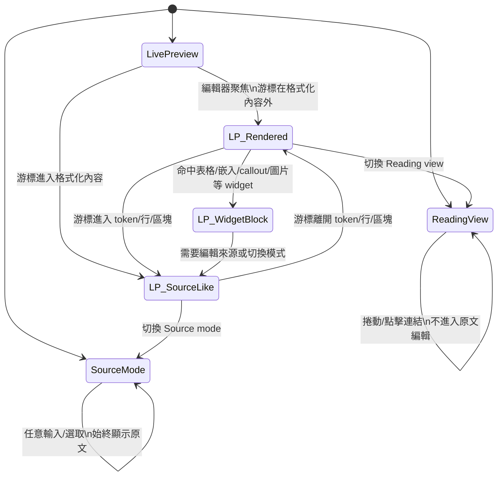
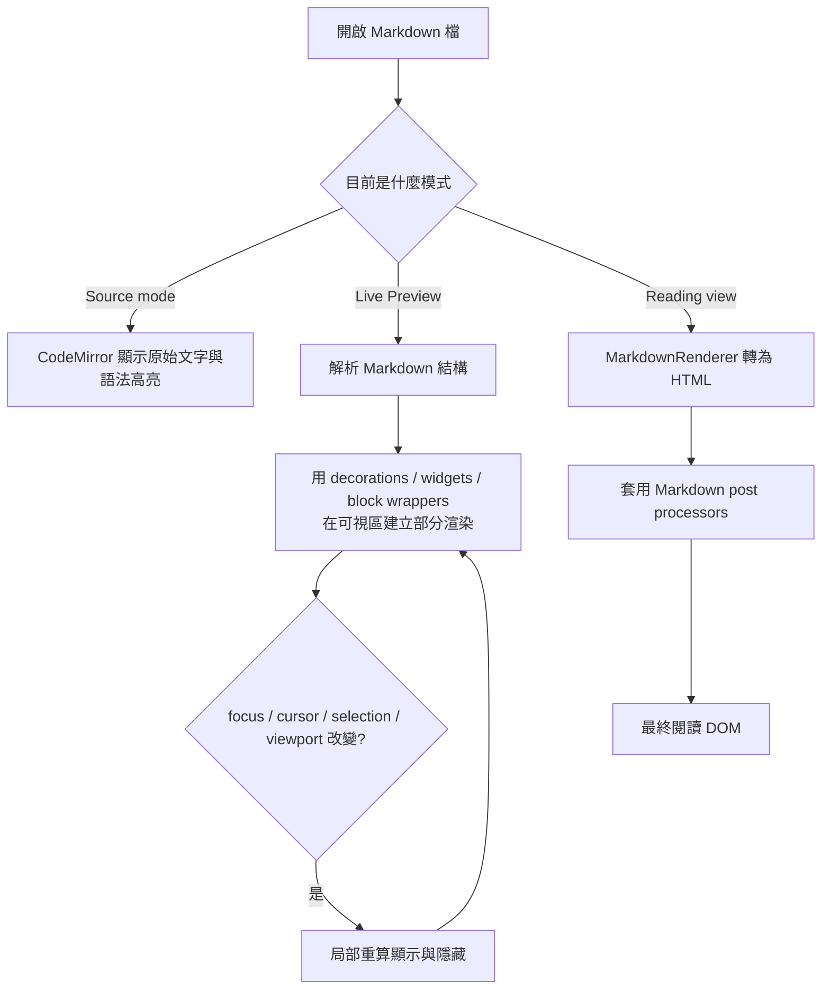

# Obsidian Markdown 即時編輯行為與 UX 深度研究報告

## 執行摘要

Obsidian 的三種核心呈現狀態不是同一套機制的不同皮膚，而是三條不同的顯示路徑：**Source mode** 是完整原始 Markdown；**Live Preview** 是可編輯的混合模式，會在編輯器內「隱藏大部分 Markdown 語法、改以局部渲染/小工具顯示」，而且當游標進入格式化內容時，底層語法會重新顯示；**Reading view** 則是完整的閱讀型 HTML 渲染。官方開發文件也明確把 Reading view 的擴充點定義為 Markdown post processor，而把 Live Preview 的擴充點定義為 CodeMirror 6 editor extension，這代表兩者在技術結構上確實不同。Obsidian 另外明示其 Markdown 基礎能力來自 CommonMark、GitHub Flavored Markdown 與 LaTeX；Live Preview 的編輯層則可由 CodeMirror 6、其 decorations/widgets/atomic ranges 機制，以及增量 Markdown parser 來最可靠地解釋。citeturn44view0turn19search0turn19search1turn34view1turn10view0turn22view3turn15view3turn22view2

對實際 UX 而言，Obsidian 的 Live Preview 成功把「閱讀感」拉進編輯器，但代價是**可見語法與可編輯語法不再一一對應**。這在一般文字、標題、強調、連結、內部連結、標籤、清單與核取方塊上通常是優勢；但在表格、腳註、複雜數學、巢狀 callout、大型檔案與多游標操作上，則會暴露邊界條件。版本差異尤其重要：**Properties/frontmatter 的視覺編輯器**是 1.4 以後的行為、**表格小工具編輯器**是 1.5 以後的行為、**reference-style links 在 Live Preview 正確渲染**要到 1.8、**圖片可拖曳調整尺寸**要到 1.12、而**大型表格/大型 callout 的解析與即時呈現優化**則到 1.9.10 才明顯加強。由於使用者未指定版本，本報告會把這些「版本分水嶺」當成分析主軸，而不是假定所有版本都相同。citeturn36search11turn28view2turn28view4turn30view0turn28view6

整體結論很清楚：如果你的工作以**文字流暢書寫、快速連結、任務清單、筆記整理**為主，Live Preview 是 Obsidian 的主力模式；如果你需要**精確操控原始 Markdown、純文字表格、腳註、微調 YAML、複雜數學或外掛相容性檢查**，Source mode 仍是更穩定的「真相層」；Reading view 則是**最終審稿層**，不是編輯層。citeturn44view0turn20search1turn26search13turn12search3

## 研究範圍與方法

本報告以 **截至 2026-05-29 可公開查得的官方文件、官方 changelog、官方開發文件、CodeMirror 一手文件，以及 Obsidian 英文/中文論壇與 GitHub/論壇問題回報**為基礎，優先使用官方說明作為高權重證據；社群討論則用來補齊「官方沒有寫成明文規格、但可從 CSS selector、DOM 觀察、回歸修正紀錄與重現步驟推知」的行為。這樣做的原因是：Obsidian 官方確實有說明三種模式，但**沒有提供一份逐元素、逐邊界條件的完整狀態機規格**。citeturn44view0turn28view1turn19search0turn19search1turn22view1turn22view2

本文在測試假設上採用下列基線：**Obsidian 版本未指定、OS 未指定、預設假設無社群外掛、無自訂 CSS snippet、使用預設主題，若討論是行動端或特定版本才會特別標記**。同時，因為 Obsidian 在 1.4、1.5、1.8、1.12、1.9.10 都對編輯器行為做過具有結構性的調整，本報告會把差異直接寫入分析，而不是把舊行為當成雜訊。citeturn36search11turn28view2turn28view4turn30view0turn28view6

下表先給出三種模式的基準比較，後面的逐元素矩陣都以此為準：

| 模式 | 是否可編輯 | Markdown 語法可見性 | 渲染/擴充基礎 | 實務定位 |
|---|---|---|---|---|
| Source mode | 可編輯 | 全部可見 | CodeMirror 編輯器；不做 Live Preview 的語法隱藏 | 原始文字精修、精確排版、排錯 |
| Live Preview | 可編輯 | 隱藏大部分語法；游標進入格式化內容時顯示底層語法 | CodeMirror 6 + editor extensions + decorations/widgets | 日常寫作、邊寫邊看 |
| Reading view | 不可編輯 | 幾乎完全不可見 | MarkdownRenderer + Markdown post processors | 成品閱讀、審稿、輸出前檢視 |  
| 依據 |  |  |  | 官方說明三種 view/mode；官方開發文件把 Reading 與 Live Preview 的擴充點分開；社群開發討論也明言兩者不是同一引擎。 citeturn44view0turn19search0turn19search1turn34view1turn34view2 |

## Markdown 元素行為矩陣

先說總規則：**Source mode 一律以原文為準**；**Reading view 一律以完整渲染結果為準**；**Live Preview 則是「大部分 inline/部分 block 會在非焦點時用渲染或 widget 取代語法，游標進入時再還原成可編輯源碼」**。但這個「還原」不是對所有元素完全一致，尤其是表格、圖片、embed、callout、腳註與 properties。官方只寫到「顯示格式化文字並隱藏大部分 Markdown 語法；游標進入格式化內容時顯示底層語法」，其餘精細差異必須由 changelog 與社群重現補足。citeturn44view0turn28view1turn34view3turn42view0turn22view1

| 元素 | Source mode | Live Preview | Reading view | 游標、輸入與版本備註 |
|---|---|---|---|---|
| 標題 H1–H6 | 原樣顯示 `#` 到 `######` | 以標題字級/樣式顯示，通常隱去 `#`；游標進入該格式化內容時，底層語法重新可見 | 純標題渲染 | 官方定義最多 6 層；LP 的一般規則是游標入格式化內容即顯示語法。社群也直接觀察到「點到標題就會顯示井號」。1.6.1 修過「行尾 trailing # 標題不渲染」問題。citeturn7search5turn44view0turn35view0turn40search11 |
| 段落與換行 | 原始換行完整可見 | 行內樣式近似閱讀；單次 Enter 仍只是同段延續或軟換行語意，空白行才是新段落 | 依 Markdown 語意整理段落、折疊多餘空白 | 官方說明：空白行才形成新段落；單行 Enter 預設不會在 Reading 形成多個可見段落；Shift+Enter 可插入 line break。citeturn40search2turn6view6 |
| 粗體、斜體、刪除線、高亮 | `**`、`*`、`~~`、`==` 全可見 | 非焦點時多半隱去標記，只保留格式效果；游標進入或選到內容時標記回來 | 純格式效果 | 官方列出支援語法；LP 的顯示/隱藏規則來自官方 view 說明。0.13.8 改善選取隱藏語法時的 selection；1.4.9 之後，套用 inline formatting 會忽略選取前後空白。citeturn6view2turn44view0turn28view1turn11search1 |
| 行內程式碼 code span | `` `code` `` 原樣顯示 | 內容通常維持 monospace/styled；游標不在 token 內時，反引號會被隱藏；游標移入 code 內容時，反引號重新出現 | 純 code 樣式 | 這是少數有明確 DOM 觀察證據的行為：社群用 Web Inspector 看到反引號 `<span>` 會因游標位置出現/消失；0.13.20 也修過「輸入 inline code 導致後續整份文件都變 code」的 bug。citeturn34view3turn42view0 |
| 程式碼區塊與語言標記 | fence 與 info string 全可見 | 常以「已樣式化的 code block」顯示；焦點/箭頭導航/選取時以 block 互動，而不是完全等同 Reading | 純 code block 渲染 | 官方語法頁支援 fenced code；0.13.8/0.14.3 都修過 code block 在 LP 的導航與點擊；CodeMirror Markdown 會依 info string 決定語言，且只取 metadata 中用於語言判定的部分。citeturn6view5turn28view1turn42view2turn22view4 |
| fenced code 加語言 | 原文顯示如 ```ts | 呈現為語言高亮 code block；語言仍來自 fence info string | 語言高亮 code block | 0.13 系列已把 code syntax highlighting 帶到 Source/LP；CodeMirror lang-markdown 對 code block metadata 的語言判定也有明確 changelog 說明。citeturn25search3turn22view4 |
| 清單與巢狀清單 | `-`、`*`、`+`、`1.` 等全可見 | 呈現為視覺化清單；巢狀縮排視覺受 editor 與設定影響 | 純清單渲染 | 官方語法頁支援 unordered/ordered list；CodeMirror Markdown 有 `insertNewlineContinueMarkup`，且 2022 起已支援 task list continuation；1.8.3 把 `Tab indent size` 也用到視覺縮排。2-space indentation 在社群與中文論壇仍被視為 Live Preview 的怪異區。citeturn6view7turn22view4turn43search0turn28view4turn13search11turn32search4 |
| 核取方塊 / Task list | `- [ ]`、`- [x]` 原文可見 | 以可點擊 checkbox 顯示；完成項目會視覺上刪線/灰化 | 純任務列表渲染 | 0.13.0 實驗版就把 checklist 替換成 checkbox，點擊可切換狀態；0.13.8 讓完成任務灰化/刪線接近 Reading；1.6.1 修過 folded region 內游標/點擊造成 checklist 自動展開。citeturn28view0turn28view1turn41search10 |
| 引用 blockquote | `>` 原文可見 | 以引用塊顯示；編輯時回到帶 `>` 的 source 風格 | 純引用渲染 | LP 對 blockquote 的 handling 在 0.13.8 被明確改善；1.12 又修「blockquotes 後少空格」；1.7.4 修過 bare link 後的 `>` 被錯判成 quote。citeturn28view1turn30view0turn28view5 |
| Callouts / Admonitions | 原文其實是 blockquote 首行加 `[!type]` | 呈現為 callout widget/區塊；可右鍵改 type，較新版本還可移除 callout formatting | 完整 callout 呈現 | 官方 help 說 callout 建立方式、支援 Markdown/Wikilinks/embeds，且 LP 可右鍵 callout name 改類型；0.14.3 改善 LP 對 callouts/embeds 的點擊；2025 之後 context menu 增加移除 callout formatting。數學在 callout 內仍有社群回報 bug。citeturn9search13turn42view2turn29search6turn27search0turn27search18 |
| 水平分隔線 | 原始分隔線語法可見 | 通常作為 block separator 呈現；精確 caret 邊界規則官方未完整文件化 | 純分隔線渲染 | Obsidian 支援 CommonMark；但 LP 對水平線的精細邊界規則沒有獨立說明。能確定的是它曾與 folding/template 邏輯互動出現 bug。這一列屬中等置信度。citeturn10view0turn42view2turn28view4 |
| 外部連結 | `[text](url)` 原文可見 | 多半只顯示連結文字與 link 樣式；編輯時會回到完整 Markdown 連結源碼 | 純連結渲染 | 官方 help 定義 inline external link；LP 早期已支援 `Ctrl/Cmd+Click` 連結；reference-style links 在 LP 要到 1.8 才宣告「正確渲染」。citeturn6view2turn25search3turn40search1turn40search7 |
| 內部連結與別名 | `[[Note]]`、`[[Note|Alias]]` 原文可見 | 顯示為可點擊內部連結；編輯時會回到 wikilink/Markdown link 源碼 | 純連結渲染 | 官方 help：輸入 `[[` 會叫出建議，別名也會進建議清單；選 alias 時，Obsidian 會插入 canonical link + display text，而不是把 alias 當目標檔名。citeturn36search1turn8view3turn8view1 |
| 錨點 / heading links / block refs | `[[#heading]]`、`[[Note#Heading]]`、`[[Note#^id]]` 原文可見 | 顯示為一般內部連結；source 編輯時才清楚看到 `#` / `^` 結構 | 依目標位置渲染/跳轉 | 官方 help 提供 `[[#` 同檔 heading 建議、`[[##` 跨 vault header 搜尋、`^` 產生 block 建議與自訂 block id。這些是 Obsidian 專屬擴充，不是標準 Markdown。citeturn8view1 |
| 影像 | `` 或 `![[img.png]]` 原文可見 | 多數情況直接顯示圖片；新版本允許在 LP 直接拖曳角落改尺寸 | 完整圖片渲染 | 0.13.0 實驗版已在 LP 預覽內外部圖片；官方 embeds/help 支援 `|widthxheight`；1.12 起圖片可在 LP 拖拉調整大小，雙擊角落重設。citeturn28view0turn10view2turn30view0 |
| 嵌入 / transclusion / embeds | `![[note]]`、`![[note#heading]]`、`![[note#^block]]` 等原文可見 | 常作為 block widget 顯示；點擊、選取、文字選取規則與一般 inline token 不同 | 完整嵌入渲染 | 官方 help 支援 note/image/audio/PDF/canvas/list/search embeds；0.14.3 改善 LP 對 embeds 的點擊與文字選取；1.8.3 還修過游標與 embed 起始 `![[` 疊到時 `Alt-Enter` 失效。citeturn10view2turn42view2turn28view4 |
| 腳註 footnotes | `[^id]`、`[^id]: ...` 原文可見 | **多數版本/多數情境不會像 Reading 那樣完整渲染與自動編號**；常保留較多 raw source 感 | 完整腳註編號與渲染 | 這是最明顯的 LP 例外之一。英文/中文論壇都有人直接指出「腳註在 LP 不會像 Reading 那樣渲染」；1.6 系列改善多行腳註與 Reading 中的 inline footnotes/hover preview，但 LP 仍不是完整 Reading。citeturn26search1turn26search3turn26search13turn35view1turn41search10turn26search12 |
| 表格 | 原始 pipe table 完整可見 | **1.5+** 變成新的表格小工具/表格編輯器，不再等同傳統純文字表格；可 Tab 換格、右鍵增刪排序、選列/欄 | 純 Markdown table 渲染 | 這是另一個關鍵版本分水嶺。官方在 1.5 公開版引入新表格編輯器；社群明確指出 1.5.3 後，若想看純文字表格，通常得切換到 Source mode。之後又持續修 selection/undo/cursor/link-tag-in-cell/backspace 選表等問題。citeturn28view2turn12search3turn12search7turn12search8turn28view3turn12search5turn40search14 |
| 數學 / LaTeX 區塊 | `$$ ... $$` 原文可見 | 會預覽為數學區塊，但進入編輯時常回到 source；與選取、Vim、callout 的互動曾有多個 bug | 完整 MathJax 渲染 | 官方 help 用 MathJax + LaTeX；0.13.0 實驗版已預覽 block LaTeX，之後 inline LaTeX 也加入；但社群仍回報 cursor/jumpiness/Vim/callout 內數學等邊界問題。citeturn8view0turn28view0turn25search3turn27search2turn27search3turn27search18 |
| YAML frontmatter / Properties | 完整 YAML 顯示 | **1.4+** 預設多半進入視覺 properties 編輯器；若設定為 Source，則顯示 raw YAML | Reading 也可顯示視覺 properties 區，但不等於可自由編 source | 官方 help：`---` 置於檔首可建立 properties；Properties in document 有 Visible/Hidden/Source。1.4.6 之後 frontmatter 若不在第一行會被當普通文字；text property 不渲染 Markdown，hashtags 在 text property 也不算 tags。citeturn12search9turn20search1turn29search3turn40search10turn36search11 |
| 標籤 tags | `#tag` 原文可見 | 顯示為樣式化 tag token；編輯時仍回到包含 `#` 的文字 token | 樣式化 tag，點擊可搜尋 | 官方 help 定義 tag 語法與 YAML tags list；1.4.5 起 tag autocomplete 改為 fuzzy search；1.5 起 `Tab` 可按 segment 補完巢狀 tag；1.5.5 起表格中的 links/tags 可點。citeturn8view2turn36search13turn36search0turn36search7turn28view3turn39search3 |

有兩點值得特別拉出來看。第一，**表格與腳註是 Live Preview 最不「Typora-like」的兩個區域**：前者在 1.5 後走向 widget/editor 化，後者則長期沒有完全跟上 Reading 的腳註渲染。第二，**Properties/frontmatter 不是單純 cosmetic change**，而是編輯模型的改寫：1.4 以後你看到的常不是 YAML 本身，而是 YAML 的視覺表單。citeturn28view2turn26search13turn20search1turn36search11

## 即時預覽規則與游標切換

能直接被官方文件證實的規則很少，但最核心的一條非常明確：**Live Preview 會在編輯時隱藏大部分 Markdown 語法，而當游標進入格式化內容時，底層語法會重新變可見**。此外，0.13.20 官方 changelog 又補了一條非常重要的細節：**Live Preview 會偵測編輯器是否聚焦，才套用語法隱藏**。換句話說，LP 的顯示不是只看 token，也看 editor focus state。citeturn44view0turn42view0

從變更紀錄與社群可重現案例，可以把邊界規則整理成以下幾種高置信模式：

| 觸發條件 | Live Preview 常見結果 | 證據強度 |
|---|---|---|
| 編輯器失焦 | 語法隱藏/已渲染外觀傾向維持；官方直接說 syntax hiding 會看 editor focus | 高 |
| 游標不在某 inline token 內 | 該 token 的標記常被隱藏，例如 code span 的反引號、部分 escape 字元 | 高 |
| 游標進入某 inline token 內容 | 該 token 的源碼標記回來，便於編輯 | 高 |
| 游標進入格式化行或區塊 | 行首標記（如標題 `#`、部分 task/list/quote 前綴）會更傾向顯示 | 中高 |
| 跨越隱藏語法做 selection | 會牽涉隱藏 token 邊界；官方曾多次修 selection/selection color/selection boundary | 高 |
| 遇到 widget/replace decoration/atomic 區 | 游標常把整塊當「原子」跨過或以整體操作，而非逐字穿入 | 高 |
| 模式切換 LP ↔ Source | 視覺行高與 viewport 可能改變，尤其是大型 callout/table/嵌入內容多的筆記 | 中高 |  

| 依據 | 官方 view 說明、editor focus syntax hiding、backslash 只在非同一行時隱藏、inline code token 的 DOM 會隨游標出現/消失、CodeMirror atomicRanges 對 cursor motion/deletion 的定義、以及 Obsidian changelog 對 selection/previewed blocks 的多次修正。 citeturn44view0turn42view0turn42view1turn34view3turn22view1turn22view2turn28view1 |

把它畫成狀態機，大致會像這樣：



上圖不是官方發布的規格圖，而是依據官方模式說明、CodeMirror atomic/widget 機制與 changelog 回歸修正，整理出的**高置信行為模型**。最值得注意的是：**「游標進入元素就一定還原完整源碼」這件事只對部分 inline/block 成立，對 widget 化很深的表格、圖片、embed 並不總是成立**。citeturn44view0turn22view1turn22view2turn28view2turn30view0

多游標、雙擊、撤銷/重做則是另一個層次。對多游標來說，Obsidian 曾修過「multiple cursors 選取不顯示」「selection color 錯誤」「多一個游標出現在右上角」「API 設定多重 selection 在隱藏語法邊界失準」等問題，這表示 **LP 的 selection model 一直比 Source mode 更脆弱**。對雙擊來說，官方目前最明確文件化的是**圖片縮放角落的雙擊可重設尺寸**，以及表格 cell 的 triple/quadruple click selection 規則；對一般 inline token 的「雙擊是否顯示完整 source」則沒有完整官方規格，因此不應過度斷言。對 undo/redo 而言，表格在 1.5.5 才修到游標位置不跑掉，Vim/LP 也有過合併多筆編輯的撤銷問題。citeturn34view0turn41search4turn41search5turn41search6turn30view0turn12search5turn28view3turn42view0

渲染生命週期可以再看成另一張流程圖：



這張圖最重要的意思是：**Live Preview 不是先把整篇 Markdown 轉成最終 HTML 再讓你編，而是在編輯器 DOM 內做局部取代與小工具化；Reading view 才是完整 HTML 渲染流程**。這也是為什麼官方要求開發者：Reading 用 post processor，Live Preview 用 editor extension。citeturn19search0turn19search1turn15view3turn22view2turn22view3

## 渲染基礎與 DOM、CSS、設定影響

從可公開核實的資料來看，Obsidian 的 Markdown 底層能力至少可以穩定確認三件事。第一，官方 Help 明說 Obsidian 支援 **CommonMark、GitHub Flavored Markdown 與 LaTeX**。第二，Live Preview 的編輯層是 **CodeMirror 6**，其開發 API 甚至提供 `editorLivePreviewField` 讓外掛檢查目前是否處於 Live Preview。第三，CodeMirror 在 Markdown 編輯上使用的是**增量 Markdown parser** 與 **decorations/widgets/atomic ranges** 這一套機制；@lezer/markdown 的 README 也明說它只負責解析，不負責輸出 HTML，而 `@codemirror/lang-markdown` 則把它整合到編輯器中。citeturn10view0turn42view0turn22view3turn22view2turn22view0

對 Reading view 而言，官方開發文件給出的公共 API 名稱是 **MarkdownRenderer**，而 Reading mode 的擴充方式是 **Markdown post processor**。但需要誠實說明：**在官方 Help/Developer docs 的公開文字裡，沒有一條我能高置信引用來斷言「Reading view 目前內部就是 markdown-it」**。因此，本文不把「Reading 一定用 markdown-it」寫成結論；較嚴格的表述應是：**Reading view 經由 MarkdownRenderer/render path 把 Markdown 轉成 HTML，而 Live Preview 不是同一路徑**。citeturn23search0turn23search3turn19search1turn19search4turn34view1

從 CSS/DOM 層面，下面這段是**依據官方 changelog、社群 CSS selector、以及 CodeMirror class 家族整理出的代表性、非逐字轉錄的 annotated DOM**。它的價值不在「保證每版 DOM 一字不差」，而在於幫你理解 LP 為何和 Reading view 的 CSS 很常不能共用：

```html
<div class="markdown-source-view mod-cm6 is-live-preview">
  <div class="cm-editor">
    <!-- 一般文字/段落行 -->
    <div class="cm-line">Paragraph text...</div>

    <!-- 標題行：行本身有 HyperMD-header，# 標記常是獨立 formatting span -->
    <div class="cm-line HyperMD-header cm-header-2">
      <span class="cm-formatting cm-formatting-header cm-formatting-header-2">## </span>
      <span class="cm-header cm-header-2">Heading</span>
    </div>

    <!-- 任務列：data-task 已移到 line element -->
    <div class="cm-line HyperMD-list-line HyperMD-task-line" data-task=" ">
      <!-- 視覺上可能是 checkbox widget -->
      <span>Task item</span>
    </div>

    <!-- 表格/嵌入/callout 常不是單純 cm-line，而是 widget block -->
    <div class="cm-embed-block cm-table-widget markdown-rendered">...</div>
    <div class="cm-embed-block cm-callout markdown-rendered">...</div>
  </div>
</div>

<!-- Reading view 則更接近最終 HTML -->
<div class="markdown-preview-view markdown-rendered">
  ...
</div>
```

這個結構能被多個來源間接支持：`.markdown-source-view` / `.markdown-preview-view` 在社群 CSS 與早期寬度調整討論中是基本容器；`.cm-line`、`.HyperMD-header`、`.cm-formatting-header`、`.cm-hmd-internal-link`、`.cm-hashtag-begin/.end` 等 class 反覆出現在 Live Preview CSS 實務中；`.cm-embed-block.cm-table-widget` 與 `.cm-embed-block.cm-callout` 則直接出現在表格與 callout 的 CSS/thread 中；`data-task` 移到 line element 則是官方 changelog 的明文。citeturn24search8turn18view2turn38search0turn38search7turn39search3turn37search7turn37search3turn28view1

真正會改變行為的設定，主要有四個：

| 設定/擴充點 | 對行為的影響 |
|---|---|
| Default editing mode | 決定新分頁預設進 LP 或 Source |
| Properties in document | 決定 frontmatter 顯示為 Visible / Hidden / Source |
| Markdown post processor | 只改 Reading view 的 HTML 呈現 |
| Editor extension | 才能真正改到 Live Preview / Source mode 的編輯器渲染 |  

| 依據 | 官方 view/help 與 properties/help 都有明文；官方開發文件與開發者論壇也把 Reading 與 Live Preview 的擴充路徑分開。 citeturn44view0turn20search1turn19search0turn19search1turn34view2 |

順帶一提，`cssclasses` property 在新編輯器中從 0.13.20 起就受支援；這意味著主題與 snippet 不只是 cosmetic，而是會實際改變 LP 的觀感與可點擊區域。也因此，很多社群「Live Preview 很怪」的抱怨，其實有一部分是**模式、版本與 CSS 三者疊加**的結果。citeturn42view0turn18view1turn35view3

## UX 影響與已知問題

**可發現性**是 Live Preview 最大的 UX 張力。優點是畫面比 Source mode 乾淨，筆記看起來更接近成品；缺點是新手常會誤以為「這就是可直接編 HTML 的閱讀模式」，結果一點到標題、checkbox、tag、link，突然又冒出源碼，形成視覺斷裂。中文論壇就有使用者直接問，能不能在 LP 裡「點到標題不要顯示井號、點到 checkbox 旁邊不要顯示 `- []`」；另一個中文腳註討論也顯示，很多人一開始會把 LP 誤認成 Reading。這不是單一使用者誤會，而是 LP 本身的**混合表徵**帶來的自然認知負擔。citeturn35view0turn35view1turn44view0

**編輯可供性**方面，Live Preview 對日常筆記很強，但對「需要精確操控原始文本」的情境有明顯摩擦。表格是最典型案例：1.5 之後的表格編輯器讓「新增欄列、排序、複製貼上、Tab 換格」變容易，但也讓習慣手改 pipe table 的人失去 LP 內直接看純文字表格的路徑。這也是為什麼 1.5.3 後，社群連續出現「希望在 LP 中加回 plaintext table editing toggle」的需求。腳註則相反：它不是太 widget 化，而是**在 LP 中仍過度 source-like**，使得註腳寫作流程通常要靠 Reading 或外掛輔助。citeturn28view2turn12search3turn12search7turn26search13turn35view1

**效能**方面，官方沒有提供一份專門比較 LP / Source / Reading 的系統性 benchmark，但 changelog 可以看出 Obsidian 團隊持續在修「大檔案、長 Markdown、表格、callout、次螢幕 popout」造成的效能與顯示問題。1.6 公開版特別提到更快的 workspace loading 與更長 Markdown 檔 parsing；1.9.10 又針對大型表格與大型 callout 的 parser/path 做優化，做法是「初次載入稍慢，但後續可即時渲染」。這和 CodeMirror 官方對 view plugin/viewport-limited decorations 的建議方向一致：**LP 的成本主要來自可視區內的動態裝飾，而不是單純純文字顯示**。citeturn29search4turn28view6turn15view3

**可及性與行動端**方面，底層編輯器 CodeMirror 6 本身標榜對螢幕閱讀器、鍵盤使用者、行動裝置有良好支援；但 Obsidian 自己在 1.1.0 Mobile 發佈時也坦白說，Live Preview「尚未完全針對 mobile 最佳化」，尤其是 embeds 與 code blocks，必要時建議改用 Source mode。後面幾個版本則持續修 iOS/行動端在 LP 的問題：像是 iOS 無法把游標選到 links、行動端選取文字閃爍、長按 links 才出 context menu 等。這表示「LP 本身可行」和「LP 在觸控設備上成熟」是兩件不同的事。citeturn22view0turn31search3turn31search1turn31search16turn31search9

**已知 quirk** 則非常多，但最值得列為實務注意事項的有五個。第一，**表格在 LP 與 Source 的編輯模型不同**，切模式是常態而不是例外。第二，**腳註在 LP 不是 Reading 的等價品**。第三，**多游標與隱藏語法邊界**曾經長期不穩。第四，**切換 LP/Source 時 viewport 位置不保證穩定**，尤其是大量 callout 的筆記。第五，**CSS selector 在 LP 跟 Reading 經常不同**，所以很多只改 `.markdown-preview-view` 的 snippet 在 LP 會失效。citeturn12search3turn26search13turn34view0turn35view2turn24search8turn39search3

## 測試案例與限制

若要在未指定版本/OS 的情況下做最嚴謹的驗證，建議把測試分成三層：先在**乾淨 vault、預設主題、無社群外掛、無 snippets**下驗證核心規則；再在**版本分水嶺（1.4、1.5、1.8、1.12）**重跑受影響案例；最後才在你的實際工作 vault 重跑。這樣才能區分「Obsidian 核心行為」、「版本差異」與「主題/外掛/CSS 干擾」。官方 bug 報告與中文/英文論壇也一再要求先在 sandbox 或無外掛條件重現。citeturn27search19turn39search10turn35view2

下表整理的是**可重現、而且對理解 LP 很有代表性**的 edge cases。因為你沒有指定版本，表中的「實際」欄位會同時標示**歷史實際行為**與**是否已在較新版本修正**：

| 案例 | 重現步驟 | 預期 | 實際 / 版本註記 |
|---|---|---|---|
| 行內 code 的反引號顯示切換 | 在 LP 輸入 `This is \`code\``，將游標停在 code 內外反覆移動 | code 樣式保留，但源碼標記只在編輯時出現 | 社群用 Inspector 直接觀察到反引號 span 會隨游標進出而出現/消失。citeturn34view3 |
| 標題/checkbox 點擊後顯示源碼 | 在 LP 點進標題行與 task 行 | 可見語法只在需要編輯時出現 | 中文論壇使用者直接描述「點到標題顯示井號、點到 checkbox 旁顯示 `- []`」。citeturn35view0 |
| API 多游標選取遇到隱藏語法邊界失準 | 用 `editor.setSelections` 選多個 `###` | 每個 `###` 都被完整選到 | 實際只有第一個完整，其餘只剩游標；Source mode 正常。論壇有完整重現碼。citeturn34view0 |
| LP 中表格無法回到純文字編輯 | 在 1.5+ 的 LP 內點入 Markdown table | 進入表格時可切回 raw pipe syntax | 實際是新 table editor/widget；若要純文字表格，多數情況得切 Source mode。citeturn28view2turn12search3turn12search7 |
| 表格 undo/redo 游標漂移 | 在 1.5 早期版表格中做編輯，再 undo/redo | 游標回到合理位置 | 1.5.5 changelog 明確修過「undo/redo 讓游標跑錯位置」。citeturn28view3 |
| 腳註在 LP 不完整渲染 | 在 LP 輸入官方 footnote 範例 | 參照應像 Reading 一樣編號/渲染 | 多個社群與中文論壇都說 LP 不會像 Reading 那樣完整渲染；1.6 改善的是 multiline/Reading hover preview，不是把 LP 變成 Reading。citeturn26search3turn26search13turn35view1turn41search10 |
| LP/Source 切換導致 viewport 位移 | 在含大量 callout 的筆記中於中段來回切 LP/Source | 來回切換後視口大致回原位 | 中文論壇回報可偏移多行甚至跑到尾端；屬版本/內容結構敏感問題。citeturn35view2 |
| 行尾 `#` 的標題不渲染 | 在較舊版本 LP 建 `## heading ##` 類型內容 | 可正確視為 heading | 1.6.1 才修「trailing # at end of line」渲染失敗。citeturn41search10 |
| bare link 後的 `>` 被誤判為引用 | 在 link 後接 `>` | `>` 應保留字面意義 | 1.7.4 才修這個 parser 邊界問題。citeturn28view5 |
| 圖片在 LP 的尺寸重設 | 1.12+ 在 LP 拖圖片角落改大小，再雙擊角落 | 雙擊應重設尺寸 | 1.12 引入拖曳改尺寸；1.12.5/1.12.6 修過雙擊重設異常。citeturn30view0 |
| 行動端 LP 編 embeds/code blocks 不順 | 在 mobile/觸控裝置用 LP 編輯 embed 或 code block | 應有與桌面近似的穩定體驗 | 1.1.0 Mobile 官方就提醒尚未 fully mobile optimized；後續持續修 iOS link cursor 與選取閃爍等問題。citeturn31search3turn31search1turn31search16 |

最後必須保留幾個**限制與未決問題**。第一，官方沒有發布一份「每個 Markdown 元素在 LP 中的游標邊界狀態機」，所以本文對部分元素的細膩邊界規則，只能做到**高置信推論**，不能宣稱是官方規格。第二，Reading view 內部是否仍以 markdown-it 為核心，公開官方文件沒有給出足夠明文，因此本文刻意不把它寫成定論。第三，DOM/CSS class 雖可由 changelog與大量社群 selector 交叉驗證，但依然可能隨版本、主題與 Chromium/Electron 升級改變。第四，行動端 IME、觸控選字、外接鍵盤與 RTL 行為都高度裝置相關，即使 changelog 顯示已修，也不代表所有設備完全一致。citeturn19search0turn19search1turn23search3turn34view1turn31search3turn29search4